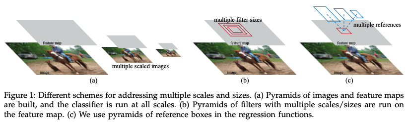

# Faster R-CNN

저자 :  
Shaoqing Ren,  
He(SPPNet), Ross(R-CNN)이 2, 3 저자로 참여  
출처 :

1. [Faster R-CNN 원문](1506.01497.pdf)
2. [갈아먹는 머신러닝](https://yeomko.tistory.com/17)

Contribution :

1. Selective search를 사용하여 계산해왔던 Region Proposal을 Neural Network로 끌고 와서 end-to-end Object detection을 구현하였다.
2. 5fps라는 빠른 속도
3. Pascal VOC 기준 78.8%의 성능 (Backbone network의 발전 + end-to-end model)

# Abstract

기존 Object detection networks는 object의 위치를 찾는데 region proposal algorithms에 의존해왔다.  
응용된 SPPNet이나 Fast R-CNN은 이러한 detectijon networks의 실행시간을 줄이긴 하였지만 Region Proposal을 계산하는 것이 bottleneck이었다.  
이번 논문에서는 Region Proposal Network (RPN)을 소개한다.  
RPN은 전체 이미지의 convolutional features를 detection network와 공유하는데 이를 통해 거의 cost-free인 region proposals을 가능하게 한다.  
RPN은 fully convolutional network로 object bounds와 각 위치에 따른 objectness scores를 동시에 예측한다.  
RPN은 end-to-end로 학습되어 높은 수준의 region proposals을 제공하여 Fast R-CNN이 detection을 할 수 있도록 한다.  
RPN과 Fast R-CNN을 병합하여 convolutional features를 공유하는 하나의 network를 만든다. (**_attention_** mechanisms 으로 불린다. (??? 잘 모르겠음))  
매우 깊은 network인 VGG-16에 대해서도 모든 과정에 걸리는 시간이 5fps(0.2s per image)밖에 걸리지 않고 GPU에서 이제 모든 과정이 진행될 수 있게 되었다. 또한 이렇게 빠름에도 PASCAL VOC 2007, 2012 기준으로 state-of-the-art의 정확도를 보여주었다.

# Introduction

## R-CNN, Fast R-CNN, SPPNet

### History

R-CNN은 Region proposal methods(e.g. Selective Search)을 이용하여 성공하였다. 하지만 기존의 개발된 것들처럼 computational cost가 비쌌다.  
하지만 이후 Fast R-CNN, SPPNet이 sharing convolution을 통해 시간을 near real-time 수준까지 단축하였다.  
하지만 이 시간은 region proposal time을 제외하고 말한 것이다.

### Region Proposal time

Selective Search의 예시를 들면 이 method는 CPU에 implement 되어있기 때문에 속도가 굉장히 느리다. (2 sec/image)  
정확도와 속도를 trade-off 한 EdgeBoxes : 0.2 sec/image  
그럼에도 불구하고 이 부분이 여전히 실행 시간의 bottleneck 이다.

### CPU vs. GPU

R-CNN이 빠른 이유 중 하나가 GPU를 사용하기 때문인데, 단순하게 생각하면 SS를 GPU에 implement하면 된다. **_하지만 re-implementation은 down-stream detection network를 무시하여 sharing에 중요한 기회를 잃을 수 있다. (이해 X)_**

## In this paper... Region Proposal Networks (RPNs)

re-implimentation이 불가능하여 새로운 알고리즘을 만들었다.  
Proposal 계산을 Neural Network로 끌고 왔다.  
이를 통하여 proposal 계산이 거의 cost-free의 효과를 얻었다. (Sharing convolutions 덕분에 marginal cost만 계산 : 10ms per image)

RPN은 일종의 fully convolutional network (FCN)이다. Selective Search와 같은 method가 아니고, fc-layer 대신 1X1 conv 사용 등.  
기존에는 multiple scaled images(Figure 1(a))나 multiple filter sizes(Figure 1(b))를 이용하여 피라미드 형식으로 예측하였다면, Faster R-CNN은 **_anchor boxes_**(Figure 1(c))를 사용하였다. 이를 통해 단순 이미지의 나열을 막을 수 있다.  
이 모델은 single-scale images에서 잘 학습되고 잘 예측한다.

## Train Alternately

Fine-tuning 할 때, region proposal과 object detection 부분을 나누어 번갈아가며 학습한다. (다른 한 파트는 고정)  
이렇게 학습해야 더 빠르게 학습할 수 있다. (e.g. Region proposal이 처음 학습이 안되어있는데 이 때 이미 detection 부분이 잘못된 region proposal 때문에 backpropagation 되면 망가지는 것이다.)

### 성능

강력한 기준선인 Selective Search with Fast R-CNN 보다 성능이 좋았다. (computation이 가벼워짐에도.)  
SS에 비해 proposal에 걸리는 시간이 10ms per image이고 전체 과정을 통해 predict 하는데 걸리는 시간도 5fps로 매우 빠르다.  
**_즉, speed와 accuracy 모두를 챙겼다._**

Faster R-CNN은 frameworks로써 다른 분야에도 사용되었다. (e.g. 3D object detection, part-based detection, instance segmentation, and image captioning + commercial system)  
Competition에도 Faster R-CNN 기반의 모델이 많이 사용되었다. 이 또한 cost-efficient 뿐 아니라 성능이 좋다는 것을 의미한다.
