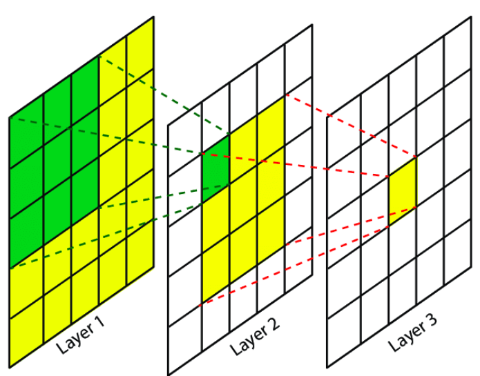
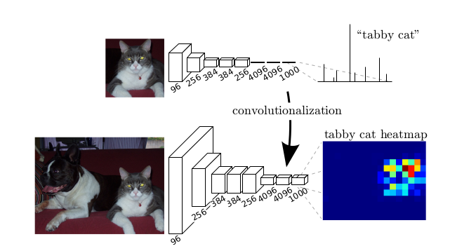

<!-- mathjax -->

# Fully Convolutional Networks for Semantic Segmentation review

# Abstract

- Convolutional networks는 feature hierarchies를 산출하는데 탁월한 능력을 가진 모델이다.
- Semantic segmentation에서 가장 좋은 결과를 보여주는 end-to-end, pixels-to-pixels로 훈련된 모델을 보여준다.
- Fully convolutional은 입력값으로 임의의 크기(input of arbitrary)를 가질 수 있고, 이에 따라서 연관된 크기의 출력물(correspondingly-sized output)을 출력하는 장점이 있다. (Semantic segmentation에서 강점)
  > 기존 분류 네트워크들은 입력 사이즈가 고정되어 있었다.
- 현대의 분류 네트워크들(AlexNet, VGG net, GoogLeNet)등을 fully convolutional network로 적용시킨 후에 fine-tuning을 통해 semantic segmentation에 적합하도록 transfer learning을 진행하였다.
- 본 네트워크의 구조는 다음과 같다. Semantic information은 deep, coarse한 layer에서 추출하였고, appearance information은 shallow, fine한 layer에서 추출하므로써 정확하고 세부적인 segmentation을 구성하였다.
- PASCAL VOC, NYUDv2, SIFT Flow등에서 좋은 성능을 보여주었고, 추론에 걸리는 시간은 1/50초 이하이다.

# 1. Introduction

## Compare with prior networks

- Convolutional Networks는 1)whole-image classification과 2)local tasks with structured output(ex. object detection) 모두에서 좋은 성능을 보인다.

- 위 두 작업의 다음 단계는 pixel 별로 prediction하는 semantic segmentation이다.

- 기존에도 semantic segmentation을 위해서 convnets을 이용하려는 연구가 있었다. 하지만 ...

  - <!-- 단점 -->

- FCN은 추가적인 기계 요소 없이 보다 발전되었다.

- 최초로 end-to-end로 학습한...

  1. Pixelwise prediction
  1. Supervised pre-training

- 학습과 추론 모두 전체 사진을 한 번에 계산하였다. (by dense feedforward computation(?))

- 본 네트워크에 있는 upsampling layers가 subsampled하는 pooling이 있음에도, pixelwise prediction과 학습 모두 가능하게 해준다.

## Efficient

- Asymptotically efficient and absolutely efficient <!-- TODO ? -->

- No patchwise training

- Pre- and post-processing을 복잡하게 만들지 않는다.

  - No superpixels, reproposals, post-hoc refinement

    |   superpixels   |          proposals           |
    | :-------------: | :--------------------------: |
    | ![][superpixel] | ![][region_proposal_network] |

- 학습되어있는 최근의 network의 classification 부분을 fully convolutional과 fine-tuning으로 재해석하였다.

  - 기존 연구들은 작은 convnet에서 학습되어있지 않은 상태로 진행하였다.

## Semantic segmentation

Pixel 단위로 어떤 object인지 classification 하는 것.

- Semantics vs. location 의 균형이 중요하다.

  What vs. where

- Skip architecture

  deep, coarse semantic info.와 shallow, fine, appearance info를 섞어 쓸 수 있게 해주었다.

- Architecture design vs. Dense prediction tradeoff

# 2. Related work

## Fully convolutional network

- Draw on recent successes of depp nets for image classification
- Matan : extending a convnet to arbitrary-sized input idea (1D)
- Wolf and Platt : expand convnet outputs to 2D
- Ning : define a convnet for coarse multiclass segmentation
- Sermanet : Sliding window detection
- Pinheiro and Collobert : semantic segmentation
- Eigen : image restoration
- Tompson : fully convolutional training effectively
- He : Discard the non-conv portion of classification nets to make a feature extractor.
  Combine (region) proposals and Spatial pyramid pooling은 국부적이고 고정된 길이의 feature를 classification을 위해 산출해낼 수 있다.
  빠르고 효율적이나 hybrid이기 떄문에 end-to-end training이 불가능하다.

## Dense prediction

Pooling하면서 be subsampled, thus it is called dense. (?)

- Ning : define a convnet for coarse multiclass segmentation
  also Farabet, Pinheiro and Collobert do
- Ciresan : boundary prediction for electron microscopy
- etc.

There are common elements.

1. Small models restricting capacity and receptive fields
1. Patchwise training
1. Post-processing by superpixel projection, random fieldregularization, filtering, or local classification
1. Input shifting and output interlacing for dense output as introduced by OverFeat
1. Multi-scale pyramid processing
1. Saturatingtanhnonlinearities
1. Ensembles

**_FCN DOES WITHOUT THIS MACHINERY_**

### In summary, the exist methods are not learned end-to-end.

# 3. Fully convolutional network

Each layer of data in a convnet : $h \times w \times d$  
$h, w$ : spatial dimensions.  
$d$ : feature or channel dimension.

- receptive field

  

## Convnet

- Translation invariance

  

- Basic components

  1. Convolution
  1. Pooling
  1. Activation function

  operate on local input region

- Depend only on relative spatial coordinates

  $$
  y_{ij} = f_{ks}(\{x_{si+\delta i, sj+\delta j}\}_{0 \le \delta i, \delta j \le k})
  $$

  $k$ : kernel size
  $s$ : stride
  $f_{ks}$ : layer type

- Transformation rule

  $$
  f_{ks} \circledast g_{k's'} = (f \circledast g)_{k' + (k-1)s', ss'}
  $$

Therefore, general deep net computes a general nonlinear function.

- Loss function

  defines a task.

  $$
  l(x;\theta) = {\Sigma}_{ij} l'(x_{ij};\theta)
  $$

# 3.1. Adapting classifiers for dense prediction

## How to change fc-layer to conv layer

### Typical recognition nets

1. Take fixed-sized inputs
1. Produce nonspatial outputs

This is because fully connected layers. (fixed dimensions and throw away spatial coordinates)

### Fully connected layers can also be viewed as convolutions with kernels that cover their entire input regions.

- Faster

  5 times faster than AlexNet  
  both the forward and backward passes are straightforward. (take advantage of the inherrent computational efficiency)

- Subsample

  The classification nets subsample to keep filters small.  
  This coarsens the output.  
  Receptive fields의 pixel stride에 따라서 output unit의 크기를 줄일 수 있다.

- No more depend on input size

  convolution impliementation of sliding windows (OverFeat)

  

# 3.2. Shift-and-stitch is filter rarefaction

Input shifting and output interlacing <!-- TODO ? -->

If the outputs are downsampled by $f$, the input is shifted(by left and top) $x$ pixels to the right and $y$ pixels down, once for every value below ($f^2$ times).

$$
(x, y) \in \{0, ..., f-1\} \times \{0, ..., f-1\}
$$

- What does it do (OverFeat)

  Less diminution of resolution.

  

<!-- reference -->

[superpixel]: img/superpixel.jpeg
[region_proposal_network]: img/region_proposal_network.png
