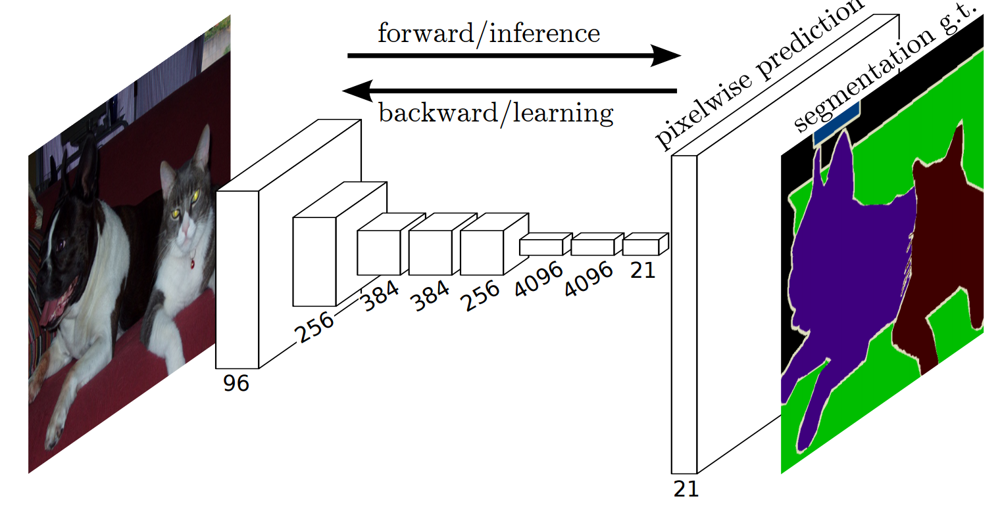
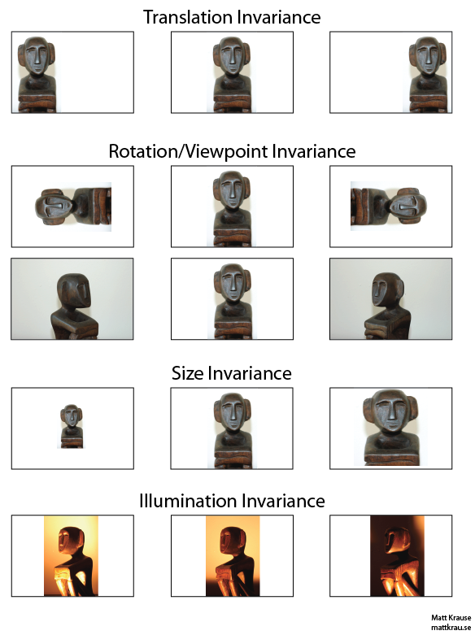
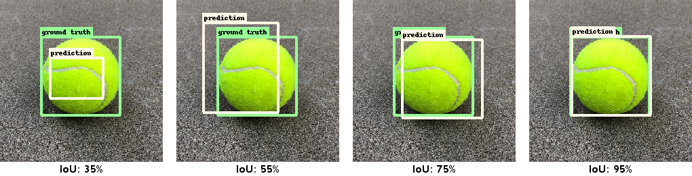
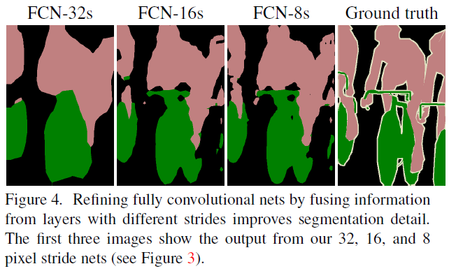
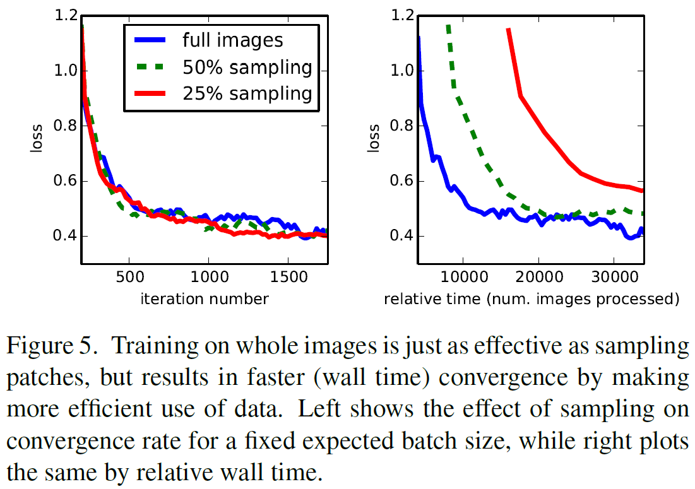
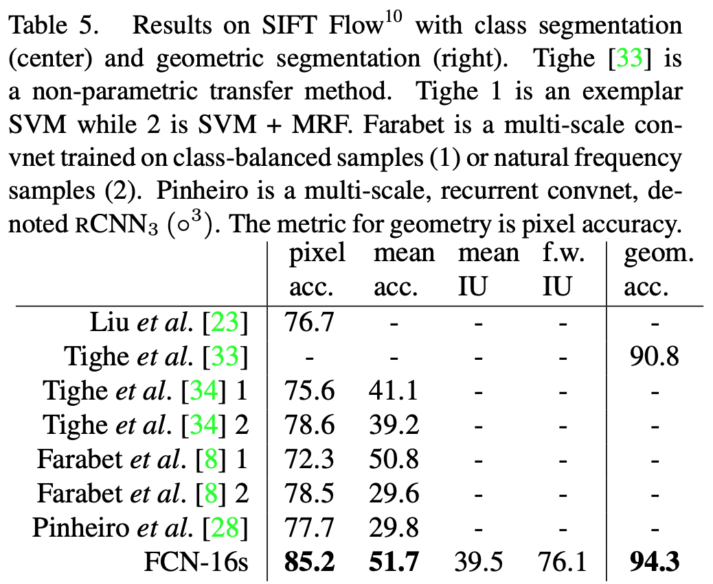

<!-- mathjax -->

# Fully Convolutional Networks for Semantic Segmentation review

# Abstract

- Convolutional networks는 feature hierarchies를 산출하는데 탁월한 능력을 가진 모델이다.
- Semantic segmentation에서 가장 좋은 결과를 보여주는 end-to-end, pixels-to-pixels로 훈련된 모델을 보여준다.
- Fully convolutional은 입력값으로 임의의 크기(input of arbitrary)를 가질 수 있고, 이에 따라서 연관된 크기의 출력물(correspondingly-sized output)을 출력하는 장점이 있다. (Semantic segmentation에서 강점)
  > 기존 분류 네트워크들은 입력 사이즈가 고정되어 있었다.
- 현대의 분류 네트워크들(AlexNet, VGG net, GoogLeNet)등을 fully convolutional network로 적용시킨 후에 fine-tuning을 통해 semantic segmentation에 적합하도록 transfer learning을 진행하였다.
- 본 네트워크의 구조는 다음과 같다. Semantic information은 deep, coarse한 layer에서 추출하였고, appearance information은 shallow, fine한 layer에서 추출하므로써 정확하고 세부적인 segmentation을 구성하였다.
- PASCAL VOC, NYUDv2, SIFT Flow등에서 좋은 성능을 보여주었고, 추론에 걸리는 시간은 1/50초 이하이다.

# 1. Introduction

## Compare with prior networks

- Convolutional Networks는 1)whole-image classification과 2)local tasks with structured output(ex. object detection) 모두에서 좋은 성능을 보인다.

- 위 두 작업의 다음 단계는 pixel 별로 prediction하는 semantic segmentation이다.

- 기존에도 semantic segmentation을 위해서 convnets을 이용하려는 연구가 있었다. 하지만 ...

  - <!-- 단점 -->

- FCN은 추가적인 기계 요소 없이 보다 발전되었다.

- 최초로 end-to-end로 학습한...

  1. Pixelwise prediction
  1. Supervised pre-training

- 학습과 추론 모두 전체 사진을 한 번에 계산하였다. (by dense feedforward computation(?))

- 본 네트워크에 있는 upsampling layers가 subsampled하는 pooling이 있음에도, pixelwise prediction과 학습 모두 가능하게 해준다.

## Efficient

- Asymptotically efficient and absolutely efficient <!-- TODO ? -->

- No patchwise training

- Pre- and post-processing을 복잡하게 만들지 않는다.

  - No [superpixels](fcn_imgs/superpixel.jpeg)
  - [region proposals](fcn_imgs/region_proposals.png) : selective search와 Edge boxes가 주로 사용
  - post-hoc refinement (사후정제처리)

- 학습되어있는 최근의 network의 classification 부분을 fully convolutional과 fine-tuning으로 재해석하였다.

  - 기존 연구들은 작은 convnet에서 학습되어있지 않은 상태로 진행하였다.

## Semantic segmentation

Pixel 단위로 어떤 object인지 classification 하는 것.

- Semantics vs. location 의 균형이 중요하다.

  What vs. where

- Skip architecture

  deep, coarse semantic info.와 shallow, fine, appearance info를 섞어 쓸 수 있게 해주었다.

- Architecture design vs. Dense prediction tradeoff

# 2. Related work

## Fully convolutional network

- Draw on recent successes of depp nets for image classification
- Matan : extending a convnet to arbitrary-sized input idea (1D)
- Wolf and Platt : expand convnet outputs to 2D
- Ning : define a convnet for coarse multiclass segmentation
- Sermanet : Sliding window detection
- Pinheiro and Collobert : semantic segmentation
- Eigen : image restoration
- Tompson : fully convolutional training effectively
- He : Discard the non-conv portion of classification nets to make a feature extractor.
  Combine (region) proposals and Spatial pyramid pooling은 국부적이고 고정된 길이의 feature를 classification을 위해 산출해낼 수 있다.
  빠르고 효율적이나 hybrid이기 떄문에 end-to-end training이 불가능하다.

## Dense prediction

Pooling하면서 be subsampled, thus it is called dense. (?)

- Ning : define a convnet for coarse multiclass segmentation
  also Farabet, Pinheiro and Collobert do
- Ciresan : boundary prediction for electron microscopy
- etc.

There are common elements.

1. Small models restricting capacity and receptive fields
1. Patchwise training
1. Post-processing by superpixel projection, random fieldregularization, filtering, or local classification
1. Input shifting and output interlacing for dense output as introduced by OverFeat
1. Multi-scale pyramid processing
1. Saturatingtanhnonlinearities
1. Ensembles

**_FCN DOES WITHOUT THIS MACHINERY_**

### In summary, the exist methods are not learned end-to-end.

# 3. Fully convolutional network

Each layer of data in a convnet : $h \times w \times d$  
$h, w$ : spatial dimensions.  
$d$ : feature or channel dimension.

- receptive field

  

## Convnet

- Translation invariance

  

- Basic components

  1. Convolution
  1. Pooling
  1. Activation function

  operate on local input region

- Depend only on relative spatial coordinates

  $$
  y_{ij} = f_{ks}(\{x_{si+\delta i, sj+\delta j}\}_{0 \le \delta i, \delta j \le k})
  $$

  $k$ : kernel size
  $s$ : stride
  $f_{ks}$ : layer type

- Transformation rule

  $$
  f_{ks} \circledast g_{k's'} = (f \circledast g)_{k' + (k-1)s', ss'}
  $$

Therefore, general deep net computes a general nonlinear function.

- Loss function

  defines a task.

  $$
  l(x;\theta) = {\Sigma}_{ij} l'(x_{ij};\theta)
  $$

# 3.1. Adapting classifiers for dense prediction

## How to change fc-layer to conv layer

### Typical recognition nets

1. Take fixed-sized inputs
1. Produce nonspatial outputs

This is because fully connected layers. (fixed dimensions and throw away spatial coordinates)

### Fully connected layers can also be viewed as convolutions with kernels that cover their entire input regions.

- Faster

  5 times faster than AlexNet  
  both the forward and backward passes are straightforward. (take advantage of the inherrent computational efficiency)

- Subsample

  The classification nets subsample to keep filters small.  
  This coarsens the output.  
  Receptive fields의 pixel stride에 따라서 output unit의 크기를 줄일 수 있다.

- No more depend on input size

  convolution impliementation of sliding windows (OverFeat)

# 3.2. Shift-and-stitch is filter rarefaction

Input shifting and output interlacing

## Few years ago... Inpterpolation

: 보간법

## OverFeat : Shift-and-stitch trick

If the outputs are downsampled by $f$, the input is shifted(by left and top) $x$ pixels to the right and $y$ pixels down, once for every value below ($f^2$ times).

$$
(x, y) \in \{0, ..., f-1\} \times \{0, ..., f-1\}
$$

- What does it do (OverFeat)

  Less diminution of resolution.

  

### Shift-and-stitch trade-off

|                 pros.                 |                 cons.                 |
| :-----------------------------------: | :-----------------------------------: |
| denser w/o decreasing receptive field | can't finer scale than their original |

**_Thus, FCN does not use the shift-and-stitch trick._**

## FCN : Changing only the filters and layer strides of a convnet

$$
f'_{ij} = \begin{cases} f_{i/s, j/s} & \text{if } s \text{divides both } i \text{ and } j;\\0 & \text{otherwise,} \end{cases}
$$

### Why Pooling? (Decreasing subsampling)

If not pooling, we don't have to reproduce.

**_Trade-off_**

|         without pooling          |              with pooling              |
| :------------------------------: | :------------------------------------: |
| Filter can see finer information | The nets have smaller receptive fields |

# 3.3. Upsampling is backwards strided convolution

## Bilinear interpolation

reference 3.2. Interpolaration

## Backward convolution (Deconvolution)

**_Upsampling with factor $f$ = Convolution with stride $s = 1/f$_**

Thus, end-to-end learning is possible.

Moreover, deconvolutional filter could learn any effective upsampling.  
e.g. bilinear upsampling, non-linear upsampling, etc...

In this article, they find optimized upsampling layer which is in Section 4.2.

# 3.4. Patchwise training is loss sampling

## Sthocastic optimization

Focus on Computational efficiency

Patchwise training : Uniform vs. Random sample patch  
Random sample is more efficient than uniform sampling of patches, because of reducing # of possible batches.

In addition, it is loss sampling which has the effect like DropConnect mask.  
DropConnect, dropout은 하나 또는 몇 개의 노드에 결과값이 너무 많이 의존하는 것을 방지하도록 하여 이미지 인식 성능 개선에 도움을 준다.

_But, what random sample? (Gaussian? uniform? ...)_

# Segmentation Architecture

## Use what?

1. Fine-tuning
2. Skip architecture

## What is trained

1. A per-pixel multinomial logistic loss
2. Validate with mean pixel Intersection over Union (IoU)
3. Mean taken over all classes, including background

# 4.1. From classifier

## Begin by proven classification architectures

### Reference networks

Consider the AlexNet, VGG nets, and GoogLeNet $\rightarrow$ select VGG 16-layer net. (be equivalent to the 19-layer net on the task)  
Only the final layer of GoogLeNet is used by loss layer. (discarding the final average pooling)

### Discarding fc-layer $\rightarrow$ to convolutions

Append $1\times1$ convolution with channel dimension 21 (# of PASCAL classes)  
The predict coarse output layer followed by a deconvolution layer. (bilinear... upsampling layer)

### Preliminary validation results

Even the worst model achieved $\sim 75\%$  
FCN-VGG16 already appears 56.0 mean IU

# 4.2. Combining what and where

### They Define FCN that combines **_feature hierarchy layers_** and **_refines the spatial precision_**.

### Dissatisfyingly coarse output

The result of deep layers is too coarse to segment images.  
For this reason, they combine shallow layers and deep layers as can be seen by figure3.  
It makes sense to make them from shallower net outputs.

# How to make FCN

## FCN architecture

## FCN-32s

Just upsample `conv7` 32x.

- The stride is 32
- Too coarse

## FCN-16s

1. Upsample `conv7` 2x.
2. Add a $1\times1$ convolution layer on top of `pool4`. (to set channel same)
3. Sum both layer. (just sum, backpropagation is easier than max fusion)
4. Upsample 16x.

- The stride is 16
- Less coarse

## FCN-8s

1. Upsample `conv7` 4x.
2. Upsample `pool4` 2x.
3. Take `pool3` (also add a $1\times1$ convolution layer on top as `pool4`)
4. Sum all of them
5. Upsample 8x.

- The stride is 8
- More Less coarse

## No more

### why?

There is not significant result.

## Notice point on FCN architecture

- Initialize 2x upsampling to bilinear interpolation, and allow the parameters to be learned.
- The new params in $1\times1$ conv is initialized with zero. (the net start with unmodified prediction)
- The learning rate is decreased by a factor of 100.

## The skip net (Even FCN-16s) improves performance by 3.0 mean IU to 62.4

Also, find a slight improvement in the smoothness and detail of the output.

## Refinement by other means

### Decreasing the stride of pooling layers

The straight way to obtain finer predictions.  
_Setting the `pool5` layers to have stride 1_ requires _a kernel size of $14\times14$_ in order to maintain its receptive field size.  
Big kernel size means increasing parameters which needs much computational cost.

**_The researchers fail learning such large filters._**

변명 : Initialization from ImageNet-trained weights in the upper layers is important.

### Shift-and-stitch trick

They found that the method is worse than layer fusion.

# 4.3. Experimental framework (Details)

## Optimization

- SGD with momentum
- Learning rate : $10^{-3}, 10^{-4}, and 5^{-5}$ for FCN-AlexNet, FCN-VGG16, and FCN-GoogLeNet, respectively
- Momentum : 0.9
- Zero-initialize the class scoring convolution layer. (Random is worse perfomance and slow)
- Dropout was included in the original classifier nets.

## Fine-tuning

**_Fine-Tune all layers._**  
Fine-tuning only output part yields only $70\%$ of the full fine-tuning.

1. Take 3 days for coarse FCN-32s version.
2. Take 1 day to upgrade to the FCN-16s
3. Take 1 day to upgrade to the FCN-8s

## Patch sampling

 

**_Use full image training_**  
By contrast, prior works randomly sampled patches.  
In this research, they recovered that **_random sampling does not have a significant effect on convergence rate_** compared to whole image training, but **_takes significantly more time_** due to **_the larger number of images_** that need to be considered per batch.

## Class Balancing

Unneccessary

## Dense Prediction

- Final layer deconvolutional filters are fixed to bilinear interpolation.
- Intermediat upsampling layers are initialized to bilinear interpolation, but it can be learned.

## Augmentation

- Randomly mirror data
- Jittering (?)

No noticeable improvement.

## More Traning Data

- PASCAL VOC 2011 : 1112 images
- Hariharan's data : 8498 PASCAL training images

Improve 3.4 points to 59.4 mean IU

## Implementation

All models are trained and tested with **_Caffe_**

# 5. Results

## Datasets <!-- TODO what are they -->

1. PASCAL VOC
2. NYUDv2
3. SIFT

## Metircs

from common semantic segmentation.

### Notation

$n_{ij}$ : # of pixels of class $i$ predicted to belong to class $j$  
$n_{cl}$ : # of classes  
$t_i = \Sigma_j n_{ij}$ : the total number of pixels of class $i$

### The 4 metrics

1. pixel accuracy : $\Sigma_i n_{ii} / \Sigma_i t_i$
2. mean accuracy : $(1/n_{cl}) \Sigma_i n_{ii} / t_i$
3. mean IU : $(1/n_{cl})\Sigma_i n_{ii}/(t_i+\Sigma_j n_{ji}-n_{ii})$
4. frequency weight IU : $(\Sigma_k t_k)^{-1} \Sigma_i t_i n_{ii}/(t_i+\Sigma_j n_{ji}-n_{ii})$

## Results of PASCAL VOC

## Results of NYUDv2

The images in NYUDv2 are RGB-D images. However, FCN-32s, 16s, 8s are trained with just RGB images. To add depth information, input of the model upgraded to take 4D.

1. Train unmodified FCN-32s model on RGB images.
2. Upgrade input dimension of the model and train on RGB-D images.

- HHA is an 3-dims encoding way which transform from RGB-D.
- Training as _late fusion_ of RGB and HHA
- Both nets are summed at the final layer
- Upgrade _late fusion_ to 16 stirde version

## Results of SIFT Flow

SIFT Flow is a dataset of 2,688 images with pixel labes.

- 33 semantic categories ("bridge", "mountain", "sun" ... )
- 3 geometric categories ("horizontal", "vertical", and "sky")

- This model performs as well on both tasks as two independent trained models.
- Learning and inference speeds are as fast as each independent models.

# 6. Conclusion

## Future works

If combination with Multi-resolution layer, the Fully convolutional networks improves dramatically in segmentation part, while simplifying and speeding up learning and inference.

# A. Upper Bounds on IU

While their mean IU has great performance, there is an upper bounds on mean IU.

| factor | mean IU |
| -----: | :------ |
|    128 | 50.9    |
|     64 | 73.3    |
|     32 | 86.1    |
|     16 | 92.8    |
|      8 | 96.4    |
|      4 | 98.5    |

This result is predicted by downsampling ground truth images and then upsampling them again.  
Conversely, mean IU is not a good measure of fine-scale accuracy.

# B. More results

While PASCAL-Context provides whole scene annotations of PASCAL VOC 2010, and there are over 400 distinct classes. Thus, the researchers do same thing on new dataset.  
In more results part, they experiment 59 classes dataset.  
They train and evaluate. The result is table6.

<!-- conclusion for me -->

<!--
In semantic segmentation problems,
Deep layers make coarse output, shallow layers make fine output.
Coarse output let us know what is it. (global topic) Because it has big receptive field.
Shallow layers let us know where is it. (details) Because it has local information.

The case of deep layers, how about big size of windows?
3X3 windows can also have big receptive field with less parameters which we sholud train. (VGG)
-->
