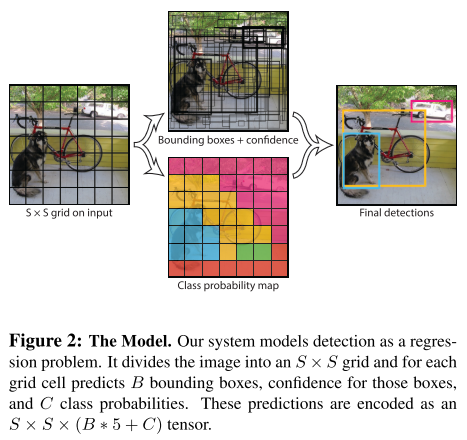

# YOLO

You Only Look Once: Unified, Real-Time Object Detection  
저자 : Joseph Redmon et al.  
출처 :

1. TAEU [blog][taeu blog]
2. deepsystem.io [ppt][deepsystem.io ppt]

### [Contribution](#yolo의-장단점)

# 1. Introduction

Real-time은 굉장히 유용하고 중요하다. 사람의 visual system이 굉장히 빠르고 정확한 real-time system의 예시이다. 그러나 현재 detection systems는 classifier을 repurpose 한 것들이다.  
R-CNN의 예시를 보면 **region proposal method(1)**를 사용하고 **classifier(2)**를 통과시키고 **post-processing(3)**으로 bounding box regreassion이나 eleminate duplicate detection등을 거치는 복잡한 pipeline을 가지고 있다.  
이 경우 prediction이 **느리고** 실제로 볼 수도 없는 각 요소들을 따로 훈련시키니 **최적화가 어렵다.**

**YOLO의 경우 object detecton을 single regression problem으로 재정의 하여 어떤 object가 어디에 있는지 한 번에 확인할 수 있다.**

## YOLO의 장단점

### Pros

YOLO 모델을 제안하여 아래 세 가지 장점을 얻어내었다.

1. YOLO는 one-stage method로 굉장히 빠르다.  
   복잡한 파이프라인 없이 object detection을 single regression problem으로 만들어서 448X448 이미지, Titan X GPU 기준으로 45fps의 성능을 보인다.
2. YOLO는 이미지를 전체적으로 보고 prediction 한다.  
   Fast R-CNN이 RoI에 대해서만 classification 하는 것과 대조되어 보이지 않는 전체 사진의 context 정보를 읽을 수 있다.  
   e.g. Fast R-CNN의 단점 중 하나인 background error를 절반으로 감소시킬 수 있다.
3. YOLO는 일반화할 수 있는 표현을 학습한다.  
   실제 사진으로 학습하고 삽화로 테스트하였을 때 다른 모델보다 잘 작동하였다.  
   _이는 내 생각에 단점으로 작용할 수도 있을 것 같다._
4. (M) End-to-end로 학습할 수 있다.  
   앞서 언급한 대로 보이지 않는 요소들(e.g. region proposal, classifier로 정확히 나눌 수 없을 것이다.)인데 따로 훈련시킨다면 최적화가 어려운 문제가 있다.

### Cons

1. 다른 최신의 object detection 모델들에 비해 정확도가 떨어진다.
2. 물체를 빠르게 식별하는 것에 비해 특정 물체에 대해서 정확한 localize를 어려워한다. (e.g. 작은 물체)

이러한 장점과 단점은 trade-off로 작용한다는 것을 실험으로 보여주었다.

# 2. Unified Detection

지금부터 보여주는 YOLO의 design은 다음을 가능하게 하였다.

1. end-to-end 학습
2. real-time speed를 가졌음에도 높은 AP 지수 유지

## Architecture

1. Input image를 $S \times S$ grid로 나눈다.
2. 각 grid cell은 $B$개의 bounding boxes를 predict 한다.
3. 각 bounding box는 5개의 predictions를 포함한다. ($x, y, w, h, C_i$)
4. 각 grid cell에는 classification을 위한 $C$개의 conditional class probabilities도 존재한다. ($Pr(Class_i|Object)$)  
   이 때, $B$의 개수와 관계 없이, 한 grid cell에는 하나의 class만 존재한다고 가정한다.
5. 결과를 출력할 때는 class-specific confidence score를 계산하여 출력한다.

responsible : Object의 중심이 특정 grid cell 내부에 존재할 경우 해당 grid cell은 responsible 하다고 한다.  
confidence score : Object가 해당 bounding box에 존재한다는 신뢰도. (i.e. $C_i = Pr(Object) * IOU^{truth}_{pred}$)  
$(x, y)$ : 해당 grid cell 내부에서 object 중심의 위치. (i.e. $x, y \in [0, 1) \  or \  (0, 1]$)  
$(w, h)$ : 전체 이미지에서 해당 bounding box의 가로 세로의 길이 (이미지에 대한 비율) (i.e. $w, h \in (0, 1]$)  
class-specific confidence score :  $Pr(Class_i|Object) * Pr(Object) * IOU^{truth}_{pred} = Pr(Class_i) * IOU^{truth}_{pred}$

<!-- reference -->

[taeu blog]: https://taeu.github.io/paper/deeplearning-paper-yolo1-01/
[deepsystem.io ppt]: https://docs.google.com/presentation/d/1aeRvtKG21KHdD5lg6Hgyhx5rPq_ZOsGjG5rJ1HP7BbA/pub?start=false&loop=false&delayms=3000&slide=id.p
