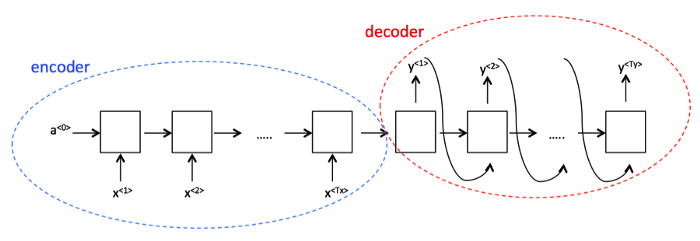
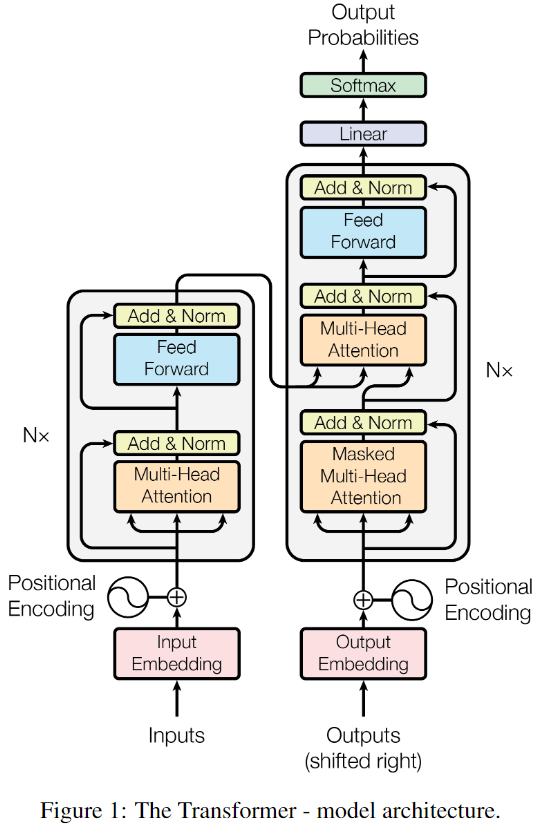
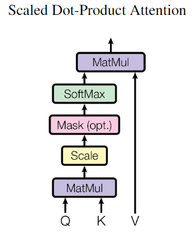
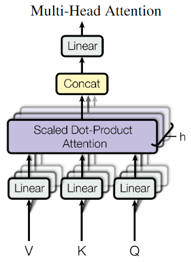
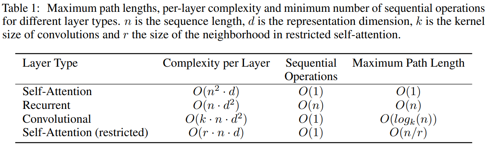
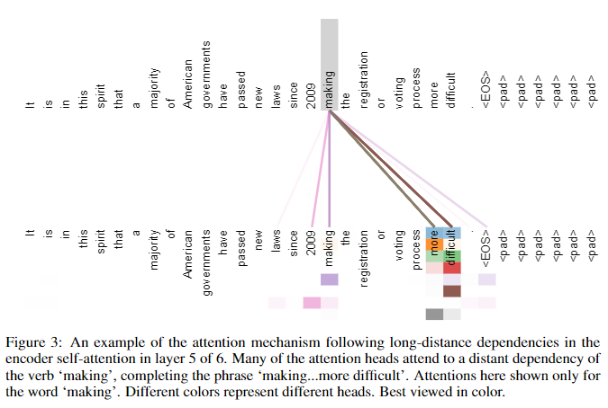

# Attention Is All You Need

- **Author:** A. Vaswani et al. (Google Brain, Google Research)
- **Reference:**
  - [Original Paper](1706.03762.pdf)
  - [Wikidocs Attention Mechanism](https://wikidocs.net/22893)
  - [Wikidocs Transformer](https://wikidocs.net/31379)
  - [NLP Tutorial - graykode](https://github.com/graykode/nlp-tutorial)

## Contribution

0. Attention mechanism만을 이용한 Transformer 모델 제안.
1. Input과 output간의 global dependencies를 이용하기 위해서 Recurrence를 피하고 attention mechanism만을 이용하였다.
2. Parallelization이 크게 높아져서 속도 향상에 도움이 되었다.
3. 높은 translation quality를 가졌음에도 학습 또한 효율적이다. (8개의 GPU로 12시간만 학습하였다.)
<!-- TODO Self attention도 들어가지 않나 ? -->

# 1 Introduction

## RNN 계열의 한계

Language modeling과 machine translation 분야에서 기존에는 **_recurrent하게 encoder와 decoder의 구조로_** 이루어진 RNN 계열의 모델 (RNN, LSTM, GRU...)등이 유행하였다. _(Language modeling이란?)_

간단하게 설명하면 $h_{t-1}$과 $x_t$를 이용하여 $h_t$를 생성하는 모델이다. 하지만 이러한 RNN 계열의 고질적인 문제는:

|  #  |                Problem                 |                            Why?                             |
| :-: | :------------------------------------: | :---------------------------------------------------------: |
|  1  | 한 벡터에 모든 문장의 정보를 담기 힘듦 |            한 줄로 구성된 encoder-decoder의 문제            |
|  2  |           Vanishing Gradient           |              문장이 길어지면 네트워크도 길어짐              |
|  3  |     긴 길이에 대해서 메모리의 부족     |                긴 길이의 예제 batching 제한                 |
|  4  |           계산과정의 비효율            | $h_{t-1}$이 나올 때 까지 $h_t$를 계산할 수 없어 기다려야 함 |

이를 고치기 위해 많은 노력을 기울였지만 구조적으로 불가능했다.

## Attention mechanism

Attention mechanism은 RNN의 한계 중 중요한 다음 두 문제를 상당 부분 해결하였다.

1. 한 벡터에 모든 문장의 정보를 담기 힘들다.
2. Vanishing Gradient

이 두 문제는 특히 문장이 길어질 수록 더 심각한데 이를 해결하므로써 input, output의 길이에 관계 없이 강력한 모델을 만들 수 있게 되었다.

- **More Info:** [Wikidocs Attention Mechanism](https://wikidocs.net/22893) <!-- TODO 나중에 정리 예정-->

## Transformer

본 논문에서 제안하는 Transformer는 recurrence를 모델 구조에서 제거하고 대신 input과 output의 global dependencies를 그리는([Attention Visualization](#appendix-attention-visualization)) attention mechanism만을 이용하였다.

1. Attention mechanism이 1, 2를 해결해준다.
2. Transformer 구조가 computation을 줄이고 병렬화를 가능하게 한다. (3, 4 해결)

# 2 Background

## Convolution Neural Networks as basic building block

- **목적:** Sequantial computation을 줄이기 위해서.
- **예시:** Extended Neural GPU, ByteNet, ConvS2S, etc.
- **단점:**
  1. 서로 멀리 떨어진 단어들은 학습이 어렵다.
  2. I/O position 수에 비례하여 연산량이 증가한다.
- **Transformer 에서는:** 거리에 관계 없이 학습이 잘 되며 연산량도 증가하지 않는다(Attention mechanism).

## Self-attention (Intra-attention)

- **What is it:** 한 문장에서 서로 다른 위치들을 통해 문장의 표현을 계산하는 attention mechanism.
- **결과:** 다양한 종류의 작업에서 성공적이다(including reading comprehension, abstractive summarization, texture entailment(질감 함의..?), and learning task-independent sentence representation).

## Question answering (QA task)

- **What is QA task:** Input sequence(답이 들어 있는 지문)을 읽고 question sequence(무엇을 물어보는가)를 받아서 답을 내는 작업. 이는 memory network의 구조이기도 하다.
- **결과:** Recurrent attention mechanism을 이용한 end-to-end memory network가 기존 방식(sequence-aligned recurrence) 보다 좋은 성능을 보였다.

# 3 Model Architecture

## Previous encoder-decoder sturcture

$\vec{x}$를 받아서 $\vec{z}$로 인코딩하고, 이를 받아서 $\vec{y}$를 출력하는 형식이다. [ref][encoder_decoder_sturcture]

## 3.1 Encoder and Decoder Stacks

<!-- TODO 각각이 무슨 역할을 하는지 뒷부분에 나오는데 이를 작성할 것. -->

### Encoder

1. **Stack blocks:** $N=6$.
2. **Multi-Head attention mechanism:** [3.2.2 Multi-Head Attention](#322-multi-head-attention).
3. **Feed-forward network:** Position-wise fully connected layer.
4. **Residual connection and Layer normalization:** $\text{LayerNorm}(x+\text{SubLayer}(x))$  
   [Layer normalization](https://arxiv.org/abs/1607.06450): 뭔가 대충 읽어봤는데 sequential data는 Batch norm을 사용하기에 batch가 너무 작다는 구조적 한계로 인한 대용품 느낌이다.)

### Decoder

1. **Most of parts are similar to Encoder:** $N=6$, Multi-Head attention, residual connection, layer normalization, etc.
2. **Inserts a third sub-layer:** The sub-layer performs multi-head attention over the output of the encoder stack.
3. **Masking:** Position $i$를 예측하기 위해서 $i$ 뒤의 단어들을 사용하면 안된다.

## 3.2.1 Scaled Dot-Product Attention

1. **Additive attention:**

   $$
    a(\vec{q}, \vec{k}) = \vec{q}^T W \vec{k}
   $$

   $\vec{q}$, $\vec{k}$의 차원이 같을 필요 없다. $\vec{q}$를 linear transformation해서 차원을 맞추는 효과. 안그래도 연산량이 많은 Sequence task에서 추가적인 $W$라는 연산과 메모리가 필요하다.

2. **Dot-product attention:**

   $$
    a(\vec{q}, \vec{k}) = \vec{q}^T \vec{k}
   $$

   $\vec{q}$, $\vec{k}$의 차원이 같아야 한다. Attention을 통과한 다음 softmax에 들어가야 하는데, 각 값들의 variance가 커져서 softmax가 한 요소에 지나치게 치우친다. 이는 softmax의 gradient가 매우 작은 영역으로 들어가게 되고 backpropagation에서 학습 속도를 늦추는 원인이 된다. 이 때문에 큰 $d_k$에서 additive attention보다 낮은 성능을 보여주었다.

3. **(Proposed) Scaled dot-product attention:**

   $$
    a(\vec{q}, \vec{k}) = \frac{\vec{q}^T \vec{k}}{\sqrt{d_k}}
   $$

   Dot-product attention에서 각 요소들의 variance가 dot-product를 하기 전과 일정하게 유지해주려는 목적으로 scaling을 진행한다.

   e.g. $\vec{q}$와 $\vec{k}$의 원소인 $q_1, q_2, ..., q_{d_k}$, $k_1, k_2, ..., k_{d_k}$의 variance가 각각 $\text{Var}[q], \text{Var}[k]$라고 가정한다면, dot-product를 진행한 값인

   $$
    \sum_{i=1}^{d_k} q_i k_i
   $$

   의 variance는 $\text{Var}[q] \text{Var}[k] d_k$이다. 이를 $\text{Var}[q] \text{Var}[k]$로 맞춰주기 위해서 $\sqrt{d_k}$ 만큼의 scaling을 진행한다. 이를 통해 더 이상 큰 $d_k$에서도 dot-product가 적은 연산량으로 좋은 학습 효율을 보여주었다.

### Final equation

$$
   \text{Attention}(Q,K,V)=\text{softmax}\left(\frac{QK^T}{\sqrt{d_k}}\right)V
$$

- $Q: |Q|\times d_k$
- $K: |K|\times d_k$
- $V: |V|\times d_v$
- $\text{softmax}\left(\frac{QK^T}{\sqrt{d_k}}\right)$: 각 Query들이 각 Key의 값을 얼마나 가지고 있나.
- $V$: 각 Key가 Value Space에서는 무엇인가?

## 3.2.2 Multi-Head Attention

**_Scaled dot-product attention을 여러 subspace에서 실행._**

$$
\begin{align}
   \text{MultiHead}(Q,K,V)&=\text{Concat}(\text{head}_1,...,\text{head}_h)W^O \\
   \text{where } \text{head}_i &= \text{Attention}(QW_i^Q,KW_i^K,VW_i^V)
\end{align}
$$

- **Input:** $\vec{q},\vec{k},\vec{v}$ has same dimension $d_{model}$. _Why? and is it okay?_  
  $\Rightarrow Q : |Q|\times d_{model}, K : |K|\times d_{model}, V : |V|\times d_{model}$
- **Input Projection matrices:** $W_i^Q\in\mathbb{R}^{d_{model}\times d_k}, W_i^K\in\mathbb{R}^{d_{model}\times d_k}, W_i^V\in\mathbb{R}^{d_{model}\times d_v}$
- **Output projection matrix:** $W^O\in\mathbb{R}^{hd_v\times d_{model}}$
- **$d_k=d_v=d_{model}/h$:** $h$개의 head로 나뉘어져서 연산하였기 때문에, 전체 computational cost는 전체 차원을 이용한 single-head일 때와 비슷하다. (하지만 병렬 처리가 가능함! _이러면 cost가 비슷한게 아니라 $h$배 더 싼거 아닌가?_)
<!-- TODO computational cost의 정의? 병렬처리해서 속도가 빠른건 cost가 줄었다고 표현하지 않는가? -->

## 3.2.3 Application of Attention in our Model

- **Encoder-decoder attention:** Queries는 이전 decoder layer에서, keys and values는 encoder에서 나온다.
- **Contain Self-attention layers:** $Q, K, V$가 모두 같은 입력에서 온다. [Self-Attention](#4-why-self-attention)
- **Masking:** Decoder에도 self attention이 있는데, 학습 과정에서 이후의 것들을 보지 않기 위해서 masking을 진행한다.

## 3.3 Position-wise Feed-Forward Networks

$$
   \text{FFN}(x) = \max(0, xW_1 + b_1)W_2 + b_2
$$

두 개의 linear layer, 중간에 ReLU. 입출력의 차원은 $d_{model}=512$, Inner-layer의 차원은 $d_{ff}=2048$.

## 3.4 Embeddings and Softmax

- Input tokens과 output tokens에 word embedding을 적용. (Learned embedding 사용)
- 두 개의 embedding layers와 pre-softmax linear transformation이 서로 weight matrix를 공유. Embedding layers에서 weight matrix를 단지 $\times\sqrt{d_{model}}$.  
  **Why?:** 다른 논문을 참고함. [Using the output embedding to improve language models](https://arxiv.org/abs/1608.05859)  
  **그래도 why?:** _의미있는 성능 향상이 있나? 그저 bells and whistles로 보임._

## 3.5 Positional Encoding

- **Transformer에는 구조적으로 순서를 알려주지 못함:** 하나의 Query로 들어가기 때문이다. 그런데 언어에서 순서는 중요한 정보이기 때문에 넣어주어야 한다.
- 선택한 방법은 입력 embedding vector에 **Positional Encoding**을 진행.

  $$
  \begin{align}
     \text{PE}_{(pos,2i)} &= \sin(pos/10000^{2i/d_{model}}) \\
     \text{PE}_{(pos,2i+1)} &= \cos(pos/10000^{2i/d_{model}})
  \end{align}
  $$

- _홀짝은 왜 나눴을까?_ <!-- TODO 홀짝은 왜 나눴을까? -->
- Sinusoidal이 아닌 다른 PE도 있지만 실험 시 비슷한 결과를 보였다.
- 그 중 Sinusoidal은 모델이 학습 시 발생하는 것보다 더 긴 문장을 추론할 수 있기 때문에 선택되었다. _(Why?)_ <!-- TODO WHY? -->

# 4 Why Self-Attentions

- 세 가지 비교 관점과 비교 방법
- **Total computational complexity:** Complexity per Layer.
- **Amount of computation that can be parallelized:** Sequential Operations.
- **Learning long-range dependencies:** Maximum Path Length.

- Self-Attention은 세 기준 모두에서 가장 빠른 것을 알 수 있다.
- Complexity per Layer는 $n<d$인 경우만이다. 하지만 대부분의 word embedding을 생각해보면 $n<d$는 대체로 만족한다.
- 그럼에도 Complexity per Layer를 더 줄이고 싶다면, 전체 문장 길이인 $n$ 대신 일부만 보는 restricted Self-Attention model을 통해서 $O(r\cdot n\cdot d)$까지 줄일 수 있다. 하지만 이 경우 대신 Maximum Path Length가 $O(n/r)$로 늘어난다. (Convolution의 kernel과 비교하면 이렇게 됨을 알 수 있다.)
- Side benefit으로 self-attention 구조를 이용하면 문장 내 단어들간의 상관관계를 알 수 있어서 보다 interpretable model이 된다. [Attention Visualization](#appendix-attention-visualization)

# 5 Training

# 6 Results

# 7 Conclusion

# Appendix Attention Visualization

<!-- reference -->

[encoder_decoder_sturcture]: https://medium.com/machine-learning-bites/deeplearning-series-sequence-to-sequence-architectures-4c4ca89e5654
