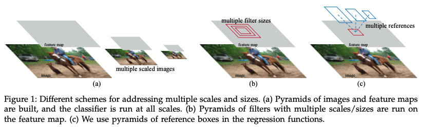
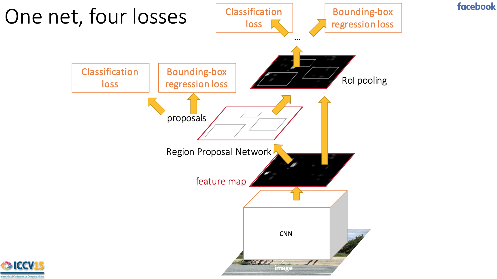
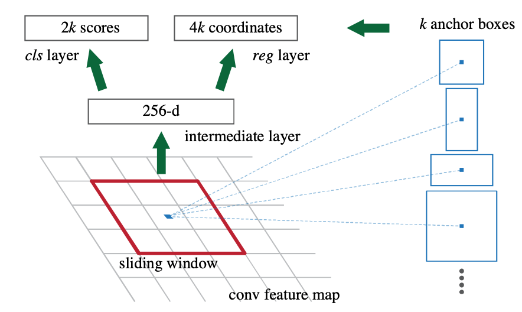
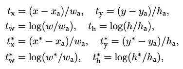
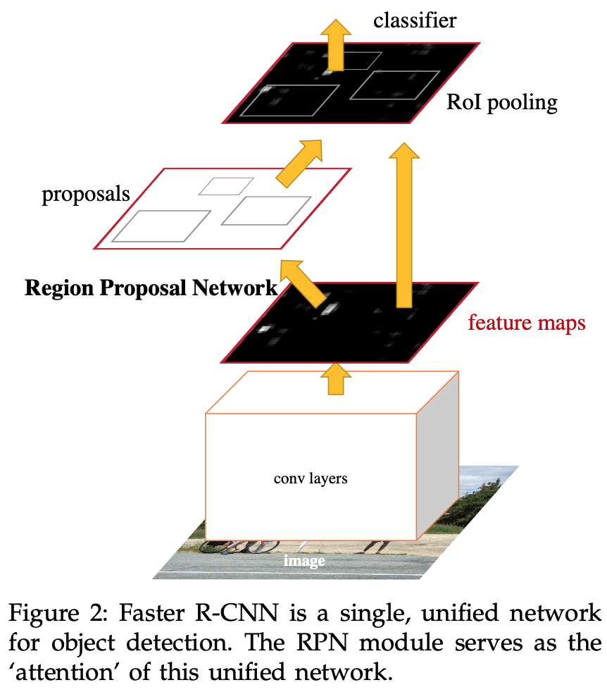

# Faster R-CNN

저자 :  
Shaoqing Ren,  
He(SPPNet), Ross(R-CNN)이 2, 3 저자로 참여  
출처 :

1. [Faster R-CNN 원문](1506.01497.pdf)
2. [갈아먹는 머신러닝](https://yeomko.tistory.com/17)

### Contribution

1. Selective search를 사용하여 계산해왔던 Region Proposal을 Neural Network로 끌고 와서 end-to-end Object detection을 구현하였다.
2. 5fps라는 빠른 속도
3. Pascal VOC 2007 기준 78.8% mAP의 성능 (Backbone network의 발전 + end-to-end model)

# Abstract

기존 Object detection networks는 object의 위치를 찾는데 region proposal algorithms에 의존해왔다.  
응용된 SPPNet이나 Fast R-CNN은 이러한 detection networks의 실행시간을 줄이긴 하였지만 Region Proposal을 계산하는 것이 bottleneck이었다.  
이번 논문에서는 Region Proposal Network (RPN)을 소개한다.  
RPN은 전체 이미지의 convolutional features를 detection network와 공유하는데 이를 통해 거의 cost-free인 region proposals을 가능하게 한다.  
RPN은 fully convolutional network로 object bounds와 각 위치에 따른 objectness scores를 동시에 예측한다.  
RPN은 end-to-end로 학습되어 높은 수준의 region proposals을 제공하여 Fast R-CNN이 detection을 할 수 있도록 한다.  
RPN과 Fast R-CNN을 병합하여 convolutional features를 공유하는 하나의 network를 만든다. (최근 인기있는 attention mechanisms을 사용하였다.)  
매우 깊은 network인 VGG-16에 대해서도 모든 과정에 걸리는 시간이 5fps(0.2s per image)밖에 걸리지 않고 GPU에서 이제 모든 과정이 진행될 수 있게 되었다. 또한 이렇게 빠름에도 PASCAL VOC 2007, 2012 기준으로 state-of-the-art의 정확도를 보여주었다.

# Introduction

## R-CNN, Fast R-CNN, SPPNet

### History

R-CNN은 Region proposal methods(e.g. Selective Search)을 이용하여 성공하였다. 하지만 기존의 개발된 것들처럼 computational cost가 비쌌다.  
하지만 이후 Fast R-CNN, SPPNet이 sharing convolution을 통해 시간을 near real-time 수준까지 단축하였다.  
하지만 이 시간은 region proposal time을 제외하고 말한 것이다.

### Region Proposal time

Selective Search의 예시를 들면 이 method는 CPU에 implement 되어있기 때문에 속도가 굉장히 느리다. (2 sec/image)  
정확도와 속도를 trade-off 한 EdgeBoxes : 0.2 sec/image  
그럼에도 불구하고 이 부분이 여전히 실행 시간의 bottleneck 이다.

### CPU vs. GPU

R-CNN이 빠른 이유 중 하나가 GPU를 사용하기 때문인데, 단순하게 생각하면 SS를 GPU에 implement하면 된다. **_하지만 re-implementation은 down-stream detection network를 무시하여 sharing에 중요한 기회를 잃을 수 있다. (이해 X)_**  
대충 re-implement하면 Fast R-CNN의 학습된 결과를 사용할 수 없을 수도 있는 위험이 있고 번거로우니 안한 것으로 보임.

> This may be an effective engineering solution, but re-implementation ignores the down-stream detection network and therefore misses important opportunities for sharing computation.

## In this paper... Region Proposal Networks (RPNs)

re-implimentation이 불가능하여 새로운 알고리즘을 만들었다.  
Proposal 계산을 Neural Network로 끌고 왔다.  
이를 통하여 proposal 계산이 거의 cost-free의 효과를 얻었다. (Sharing convolutions 덕분에 marginal cost만 계산 : 10ms per image)

RPN은 일종의 fully convolutional network (FCN)이다. Selective Search와 같은 method가 아니고, fc-layer 대신 1X1 conv 사용 등.  
기존에는 multiple scaled images(Figure 1(a))나 multiple filter sizes(Figure 1(b))를 이용하여 피라미드 형식으로 예측하였다면, Faster R-CNN은 **_anchor boxes_**(Figure 1(c))를 사용하였다. 이를 통해 단순 이미지의 나열을 막을 수 있다.  
이 모델은 single-scale images에서 잘 학습되고 잘 예측한다.

## Train Alternately

Fine-tuning 할 때, region proposal과 object detection 부분을 나누어 번갈아가며 학습한다. (다른 한 파트는 고정)  
이렇게 학습해야 더 빠르게 학습할 수 있다. (e.g. Region proposal이 처음 학습이 안되어있는데 이 때 이미 detection 부분이 잘못된 region proposal 때문에 backpropagation 되면 망가지는 것이다.)

### 성능

강력한 기준선인 Selective Search with Fast R-CNN 보다 성능이 좋았다. (computation이 가벼워짐에도.)  
SS에 비해 proposal에 걸리는 시간이 10ms per image이고 전체 과정을 통해 predict 하는데 걸리는 시간도 5fps로 매우 빠르다.  
**_즉, speed와 accuracy 모두를 챙겼다._**

Faster R-CNN은 frameworks로써 다른 분야에도 사용되었다. (e.g. 3D object detection, part-based detection, instance segmentation, and image captioning + commercial system)  
Competition에도 Faster R-CNN 기반의 모델이 많이 사용되었다. 이 또한 cost-efficient 뿐 아니라 성능이 좋다는 것을 의미한다.

# Faster R-CNN

  
출처 : ICCV15 Training 'R-CNNs' of 'various' velocities

1. Deep fully convolutional network
2. Fast R-CNN detector

RPN이 Fast R-CNN에게 어디를 보라고 할 지 알려주는 일종의 'attention' mechanism 처럼 작용한다.

## Region Proposal Networks

### 가장 궁극적인 목적은 Fast R-CNN object detection network와 computation을 공유하는 것 입니다.

Convolutional layers를 공유할 수 있다고 생각하여 진행하였다.

Zeiiler and Fergus model (ZF) : 5 layers  
Symonyan and Zisserman model (VGG-16) : 13 layers  
들을 공유할 수 있었다.

공유한 후에는 마지막 convolutional layer에 대해서 3X3 convolution을 진행한다. (same padding, large receptive를 갖게 된다.)  
Convolution으로 나온 feature map에서 box-regression(reg)과 box-classification(cls)으로 나누어 들어간다.  
이 각각의 부분에서는 1X1 convolution을 진행하여 anchors 개수와 비례하는 채널 수를 가진 feature map을 만든다.

### Anchors

reg layer와 cls layer로 나누어져 있는데 이를 벡터로 표현해보면 다음과 같다.

$$
reg = \begin{bmatrix} b_x \\ b_y \\ b_w \\ b_h \end{bmatrix} \\
cls = \begin{bmatrix} \text{object} \\ \text{not object} \end{bmatrix}
$$

Anchor box 하나 당 위와 같은 개수의 값이 존재 해야 하므로, Figure 3과 같이 각각 2k, 4k개의 parameter가 존재해야 한다.  
여기서는 문제를 단순화 하기 위해서 anchor box 하나 당 cls를 2개만 주었다.

### Why anchor?

1. 입력 이미지의 사이즈를 다양하게 한다.
   : 전체 과정을 N번 되풀이 하므로 시간 소요가 심하다.
2. 필터의 크기를 다양하게 한다.
   : 일반적으로 1번과 같이 쓰인다.
3. Anchor (Pyramid of anchors)

### Anchor의 장단점

이미지나 feature map이 단일 scale이어야만 한다.  
**_하지만, 확장을 위환 추가 cost없이 sharing features를 이용할 수 있어서 computation cost가 매우 절약된다._**

## Loss function

![][rcnn architecture with loss]  
출처 : Achraf KHAZRI - medium

Faster R-CNN에는 총 4개의 loss가 있다. RPN에 cls, reg 두 개, Fast R-CNN의 말단에 있는 cls, reg 두 개 존재한다.  
이 떄문에 학습하는 방식이 다소 독특하다.

_(나는 이 4개의 loss가 굉장히 비효율적으로 보였다. loss가 겹치는 부분이 많은데 두 개로 나눠야 하였으니...)_

$$
L(\{p_i\}, \{t_i\}) = {1 \over N_{cls}} \sum_i L_{cls}(p_i, p^*_i) + \lambda {1 \over N_{reg}} \sum_i L_{reg}(t_i, t^*_i)
$$

Fast R-CNN의 loss와 굉장히 비슷한 것을 알 수 있다. ($L_{cls}, L_{reg}$은 실제로 동일하고, \*는 ground truth)  
이 때, $N_{cls} = 256, N_{reg} \sim 2,400$로 나눠줬는데, 이후 $\lambda$를 10으로 설정해주어서 classification과 regression의 가중치를 같도록 맞춰주었다. (Fast는 하나에 대한 것이었어서 $N$으로 나눠주지도 않고 $\lambda$도 1이었다.)

Bounding box regression에 사용되는 $t$와 $t^*$는 다음과 같다.  

이 수식들을 보면 알 수 있듯이, 하나의 ground-truth box는 여러 개의 anchors에 positive label을 줄 수 있고 각각에 loss를 전해줄 수 있다.

### Training RPNs

Positive sample과 Negative sample의 비율을 맞춰준다. (왜?)

새로운 layers은 Gaussian distribution(0,0.01)으로 initialize 해주고 shared convolutional layers등은 ImageNet classification으로 학습된 parameter로 initialize 해준다.  
ZF net은 전체 네트워크를 fine-tune하였고, VGG-16 net은 conv3_1 이후의 layers만 fine-tune 해 주었다.

## Sharing Features of RPN and Fast R-CNN

독립적으로 학습된 RPN과 Fast R-CNN은 shared convolutional layers를 서로 다른 방향으로 수정할 것이다. 이를 위해 세 가지 기법을 개발하였다.

### Alternating training

1. RPN을 먼저 학습 시킨다.
2. RPN에서 나온 proposals로 Fast R-CNN을 학습 시킨다.
3. 이 과정을 반복한다.

### Approximate joint training

위 사진처럼 RPN과 Fast R-CNN을 연결한다.  
Backpropagation을 진행할 때, RPN과 Fast R-CNN 둘 다 shared convolutional layers에 backpropagation으로 영향을 준다.  
하지만 완벽한 joint는 아닌 것이, bounding box regression은 학습을 해도 proposal 박스의 좌표를 미분한 값은 무시한다.

### Non-approximate joint training

박스 좌표를 미분하기 위해서는 RoI Pooling 층이 필요하다. 이를 위해서 RoI warping이 필요한데 이는 이번 논문의 범위에서 벗어난다.

### 4-step Alternating Training

1. RPN을 ImageNet-pre-trained model을 이용하여 region proposal task로 fine-tune한다.
2. 1번에서 학습한 RPN으로 나온 proposal로 Fast R-CNN을 학습한다.  
   이 때 까지는 두 networks가 convolutional layers를 공유하지 않고 있다.
3. Detector(?) network를 이용하여 RPN의 학습을 초기화시킨다. 하지만 이제 shared convolutional layers는 고정시키고 RPN 만을 학습시킨다.  
   이제 두 networks는 convolutional layers를 공유한다.
4. 마지막으로 shared convolutional layers와 RPN을 고정시키고 Fast R-CNN만을 학습시킨다.

앞서 언급한 비슷한 Alternating training은 좀 더 반복한다. 하지만 반복해도 크게 달라지지 않는다는 것을 관측하였다고 한다.

## Implementation details

Details가 많아 중요한 부분만 요약하자면

1. 본 network는 Fast R-CNN과 마찬가지로 단일 scale에 대해서만 학습한다.  
   이를 위해 항상 짧은 변의 길이를 600pixel로 맞추었다.  
   Multi-scale보다 정확도는 떨어지지만 speed-accuracy trade-off 면에서 효율적이지 못하다.
2. Anchor box는 $128^2, 256^2, 512^2$의 크기이고 종횡비는 $1:1, 1:2, 2:1$로 총 가능한 경우는 9가지이다.  
   이는 세심하게 정한 것은 아니지만 후에 결과를 보면 성능이 좋다.
3. 이 알고리즘에서는 reception field보다 큰 물체도 검출이 가능하다.  
   물체의 중심만 봐도 무슨 물체일지 예측할 수 있다는 점을 고려했을때 말이 된다.
4. 학습 시에는 모든 cross-boundary anchors(?)를 무시한다.  
   Cross-boundary anchors는 굉장히 유의해야 한다고 한다. Outlier이기 때문에 해당 object에 대해 학습이 어렵게 만들고 수렴하지 않게 한다.  
   이에 따라 무시하게 된다면 대략 20,000개의 anchors가 6,000개로 준다.
5. 몇몇 RPN proposals는 서로 많이 겹친다. 이를 방지하기 위해서 Non-Maximum Suppression(NMS)을 사용한다.  
   IoU > 0.7만 남겨두도록하면 대략 2,000개의 proposals가 남는다.  
   NMS이후 이 중 상위 N개만 남아서 Fast R-CNN에 넣는다. (Fast R-CNN은 본래 2,000개의 proposals로 훈련하였는데 실제 테스트를 할 때는 proposals의 수가 달라지게 되는 것이다.)

# Experiments

잘 실험 했다.

## One-stage Detection vs. Two-Stage Proposal + Detection

직렬로 두 시스템을 연결하니 정확도가 더 올랐다.  
One-stage system은 처리해야하는 proposal 수가 많기 때문에 속도도 더 느리다.

_내 생각에 지금 OverFeat하고 비교를 했는데, 너무 오래전 안좋은 모델이라 그런게 아닌가..._  
_e.g. YOLO는 one-stage라 정확도는 낮지만 속도가 매우 빠르다._

# Conclusion

Region proposal 생성에 보다 효율적이고 정확한 RPNs를 보여주었다.  
Sharing convolutional features를 이용하여 region proposal 단계를 거의 cost-free로 거칠 수 있게 되었다.  
따라서 통합된 deep-learning-based object detection system을 만들었고 near real-time frame rates 수준에 이르렀다.

<!-- reference -->

[rcnn architecture with loss]: https://miro.medium.com/max/700/1*Fg7DVdvF449PfX5Fd6oOYA.png
