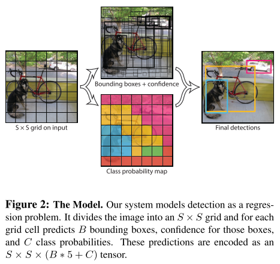
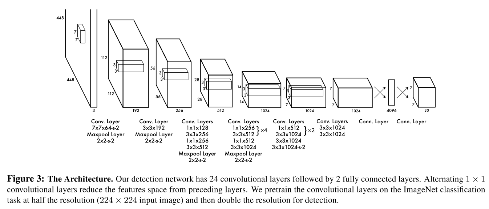
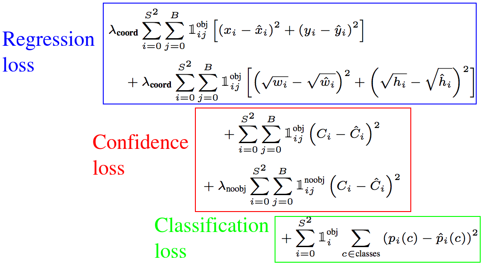
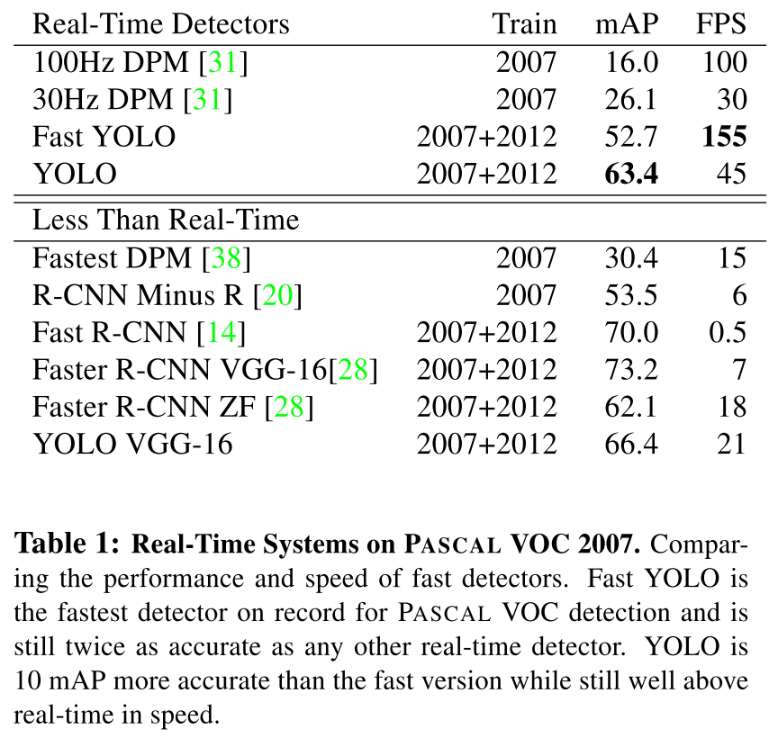
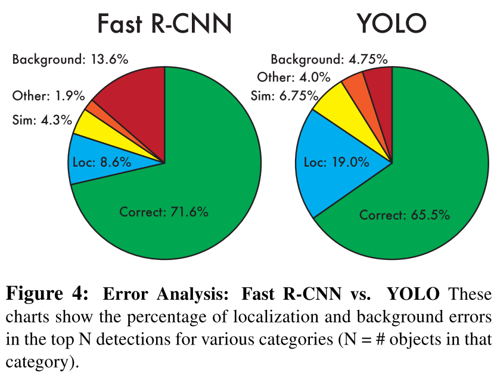
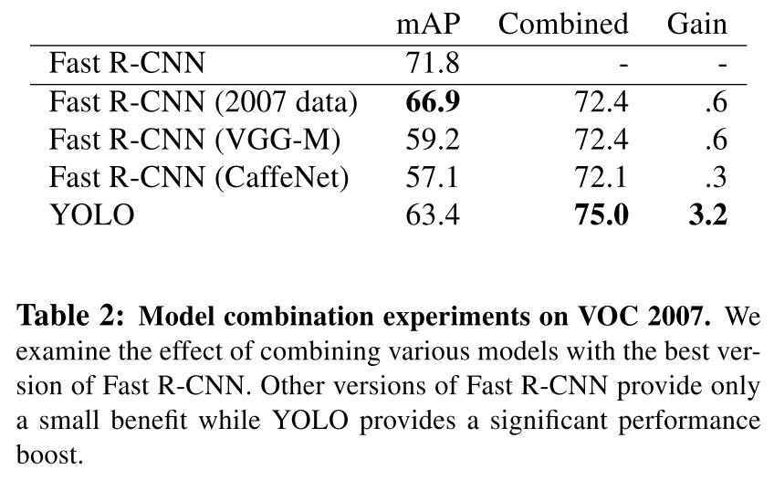

# YOLO

You Only Look Once: Unified, Real-Time Object Detection

저자 : Joseph Redmon et al.

출처 :

1. [YOLO 원문](1506.02640.pdf)
2. TAEU [blog][taeu blog]
3. deepsystem.io [ppt][deepsystem.io ppt]

### Contribution : [YOLO 제안](#yolo의-장단점)

# 1. Introduction

Real-time은 굉장히 유용하고 중요하다. 사람의 visual system이 굉장히 빠르고 정확한 real-time system의 예시이다. 그러나 현재 detection systems는 classifier을 repurpose 한 것들이다.  
R-CNN의 예시를 보면 **region proposal method(1)**를 사용하고 **classifier(2)**를 통과시키고 **post-processing(3)**으로 bounding box regreassion이나 eleminate duplicate detection등을 거치는 복잡한 pipeline을 가지고 있다.  
이 경우 prediction이 **느리고** 실제로 볼 수도 없는 각 요소들을 따로 훈련시키니 **최적화를 아주 정교하게 해줘야 한다.**

**YOLO의 경우 object detecton을 single regression problem으로 재정의 하여 어떤 object가 어디에 있는지 한 번에 확인할 수 있다.**

## YOLO의 장단점

### Pros

YOLO 모델을 제안하여 아래 세 가지 장점을 얻어내었다.

1. YOLO는 one-stage method로 굉장히 빠르다.  
   복잡한 파이프라인 없이 object detection을 single regression problem으로 만들어서 448X448 이미지, Titan X GPU 기준으로 45fps의 성능을 보인다.
2. YOLO는 이미지를 전체적으로 보고 prediction 한다.  
   Fast R-CNN이 RoI에 대해서만 classification 하는 것과 대조되어 보이지 않는 전체 사진의 context 정보를 읽을 수 있다.  
   e.g. Fast R-CNN의 단점 중 하나인 background error를 절반으로 감소시킬 수 있다.
3. YOLO는 일반화할 수 있는 표현을 학습한다.  
   실제 사진으로 학습하고 삽화로 테스트하였을 때 다른 모델보다 잘 작동하였다.  
   _이는 내 생각에 단점으로 작용할 수도 있을 것 같다._  
   _그리고 왜 ? 2번과 연결되는 것일까 ?_
4. (M) End-to-end로 학습할 수 있다.  
   앞서 언급한 대로 보이지 않는 요소들(e.g. region proposal, classifier로 정확히 나눌 수 없을 것이다.)인데 따로 훈련시킨다면 최적화가 어려운 문제가 있다.

### Cons

1. 다른 최신의 object detection 모델들에 비해 정확도가 떨어진다.
2. 물체를 빠르게 식별하는 것에 비해 특정 물체에 대해서 정확한 localize를 어려워한다. (e.g. 작은 물체)
3. (M) Input size가 제한적이다. (448 \* 448로 맞춰야 함, 하지만 알고리즘의 문제는 아닌 것으로 보임. 모델을 조금만 바꾸면 될듯 ?)

이러한 장점과 단점은 trade-off로 작용한다는 것을 실험으로 보여주었다.

# 2. Unified Detection

지금부터 보여주는 YOLO의 design은 다음을 가능하게 하였다.

1. end-to-end 학습
2. real-time speed를 가졌음에도 높은 AP 지수 유지

## Architecture

1. Input image를 $S \times S$ grid로 나눈다.
2. 각 grid cell은 $B$개의 bounding boxes를 predict 한다.
3. 각 bounding box는 5개의 predictions를 포함한다. ($x, y, w, h, C_i$)
4. 각 grid cell에는 classification을 위한 $C$개의 conditional class probabilities도 존재한다. ($Pr(Class_i|Object)$)  
   이 때, $B$의 개수와 관계 없이, 한 grid cell에는 하나의 class만 존재한다고 가정한다.
5. 결과를 출력할 때는 class-specific confidence score를 계산하여 출력한다.

**Notation**

- responsible : Object의 중심이 특정 grid cell 내부에 존재할 경우 해당 grid cell은 responsible 하다고 한다.
- $(x, y)$ : 해당 grid cell 내부에서 object 중심의 위치. (i.e. $x, y \in [0, 1) \  or \  (0, 1]$)
- $(w, h)$ : 전체 이미지에서 해당 bounding box의 가로 세로의 길이 (이미지에 대한 비율) (i.e. $w, h \in (0, 1]$)
- confidence score : Object가 해당 bounding box에 존재한다는 신뢰도. (i.e. $C_i = Pr(Object) * IOU^{truth}_{pred}$)
- class-specific confidence score : $Pr(Class_i|Object) * Pr(Object) * IOU^{truth}_{pred} = Pr(Class_i) * IOU^{truth}_{pred}$

본 실험에서는 PASCAL VOC를 통해 평가하였는데,  
$S = 7, B = 2, C = 20$를 사용하여 최종 prediction tensor는 $S \times S \times (B * 5 + C) = 7 \times 7 \times 30$의 크기를 갖게 되었다.

## 2.1. Network Design

전체 네트워크는 24개의 convolutional layers에 2개의 fully-connected layers가 붙어있는 형태이다.  
이 중 앞의 20개의 convolutional layers는 GoogLeNet에서 아이디어를 착안하였다. 하지만 inception module을 사용하지는 않고 $1 \times 1$ convolution를 이용하여 parameter 수를 감소시키는 작업만 진행하였다.

|     Normally convolution      |      Use 1X1 convolution      |
| :---------------------------: | :---------------------------: |
| ![][1x1 conv operation large] | ![][1x1 conv operation small] |

출처 : Raj Sakthi - medium - Talented Mr. 1X1: [Comprehensive look at 1X1 Convolution in Deep Learning][raj sakthi - medium]

> Fast YOLO는 24개 대신 9개의 layers를 가지며 더 적은 수의 filter 수를 갖는다.  
> 하지만 그 외 다른 모든 parameters는 동일하다.

## 2.2. Training

앞의 20 convolutional layers에 average-pooling layer, fully-connected layer를 붙여서 ImageNet 1000-class competition dataset로 학습시킨다.  
그 결과 ImageNet 2012 validation set에서 88%의 정확도로 GoogLeNet과 비견될만한 정확도를 가지게 되었다.

이제 모델을 detection을 위한 모델로 바꿔주어야 한다. 앞서 언급한 20개의 convolutional layers에 4개의 conv., 2개의 fc-layers를 붙인다. (random initialized weight) Activation function으로 leaky ReLU를 시용하였다.

이제 입력 이미지의 크기도 $224 \times 224$에서 $448 \times 448$로 바꿔준다. 마지막 layer는 $7 \times 7 \times 30$으로 각 grid 당 $(x, y, w, h, C)$에 20개 class probability 정보가 포함되어있다.

### Loss function

기본적으로 계산이 쉬운 sum-squared error를 사용한다. (but 완벽하지 않다.)

**보완된 sum-squared error**

1. 대부분의 grid 에서는 물체가 없어서(0) gradient에 overpowering을 가하여 "confidence" score를 0으로 만드려고 한다.  
   Solution : 물체가 있는 grid와 없는 grid에 서로 다른 parameter를 제공한다. ($\lambda_{\text {coord}} = 5, \lambda_{\text {noobj}} = 0.5$)
2. Large box와 small box의 sum-square error에 같은 가중치를 주면 안된다.  
    e.g.

   ${\text {In large example,}}$  
   ${\text{predict}} : (x_l, y_l, 3, 3, C_l)$  
   ${\text{ground truth}} : (x_l, y_l, 2.9, 2.9, C_l)$

   ${\text {In small example,}}$  
   ${\text{predict}} : (x_l, y_l, 0.1, 0.1, C_l)$  
   ${\text{ground truth}} : (x_l, y_l, 0.2, 0.2, C_l)$

   이 경우 width, height에 대해서 두 sum-square error가 동일하게 $0.1^2$ 이다.  
   이를 방지하기 위해서 width, height error를 구할 때는 square root를 취한다.

   ${\sqrt{\ } \text{ 한 결과}}$
   $(\sqrt{3} - \sqrt{2.9})^2 \approx 0.03^2 < (\sqrt{0.1} - \sqrt{0.2})^2 \approx 0.13^2$

3. 각 grid box에서 ground truth와 가장 큰 IOU를 갖는 bounding box를 해당 grid cell에서 "responsible" bounding box로 정한다.
4. Object가 있을 때에만 loss function에 의해 학습하고,  
   predictor가 "responsible" 할 때 학습한다.(Highest IOU만 학습됨) ($\mathbb{1}$의 필요성)  
   $\mathbb{1}^{\text{obj}}_{i}$ : i번째 cell에 object가 있으면 1 아니면 0  
   $\mathbb{1}^{\text{obj}}_{ij}$ : i번째 cell, j번째 bounding box에 object가 있으면 1 아니면 0

위 점들을 보완한 것이 위의 loss function이다.

## 2.3. Inference

Inference 하는데 YOLO는 굉장히 빠르다. (classifier-based method 같지 않게 단일 network이기 때문)  
Non-maximal suppression을 post-processing으로 사용하여 2-3%의 mAP를 늘릴 수 있었다.

## 2.4. Limitations of YOLO

1. 가까이 붙어 있는 물체를 찾는 것과 작은 물체를 잘 찾지 못한다.  
   : 각 grid cell은 제한된 개수(2)의 bounding box만 조사할 수 있고, 최종적으로는 한 grid cell 당 한 물체만 classification 할 수 있다.  
   = 굉장히 제한적인 조건
2. 새롭거나 흔치 않은 종횡비/환경 등의 조건일 때 generalize에 어려움을 겪는다.  
   : Downsampling을 많이 해서 coarse feature map에서 grid를 통해 predict 하기 때문에 일반화를 많이 해버린다.
3. 같은 IOU 차이라도 큰 물체와 작은 물체에 대해서 중요도가 다른데 이를 적용하지 않아서 작은 물체를 잘 찾지 못한다.  
   : Bounding box의 w, h에 대해 loss function을 크기별로 다르게 작동하도록 하였으나, IOU 계산하는 쪽에서 여전히 large object와 small object에 차별을 두지 않았다.

# 3. Comparison to Other Detection Systems

여러 기존 object detection 모델 중 top 모델들과 비교하였다.

## R-CNN, Fast R-CNN, Faster R-CNN

1. Tuning을 따로 하는데 복잡한 pipeline에 대해 각각 따로 학습하므로 아주 정교하게 학습해야한다.  
   : 이에 반해 YOLO는 single, jointly optimized model이다.
2. 결과로 만들어놓은 system도 굉장히 느리다. (~40s)
3. 하지만 YOLO가 98개의 bounding box를 propose 하는 것에 반해 selective search로 2000개를 propose 한다.
4. Fast와 Faster는 R-CNN보다 훨씬 빠르긴 하지만, real-time으로 사용하기에는 거리가 있다.

# 4. Experiments

많은 기존 연구들은 일반적인 detection pipeline을 빠르게 만드는데 노력하였다.  
이러한 연구들 중에서는 real-time milestone이라고 할만한 것은 존재하지 않았다. (DPM 30Hz, 100Hz 제외하고는. 하지만 이들은 정확도(mAP)가 처참하다.)  
4.1.에서는 YOLO와 real-time detector, less than real-time detector를 비교해보았다.

## 4.1. Comparison to Other Real-Time Systems

Fast YOLO는 PASCAL에서 가장 빠른 object detection method이다. 그럼에도 mAP를 유지하여 이전의 real-time 모델보다 두배의 정확도를 유지하였다. (52.7%) <!-- 표기를 어떻게 하나 ? 52.7% ? mAP 52.7 ? 52.7 mAP ? -->  
VGG-16 기반 YOLO는 더 정확하지만 속도가 real-time 보다 느리다. 본 논문은 속도에 초점을 맞췄기 때문에 선택하지 않았다. (real-time의 기준은 무엇인가 ? 30fps ?)

- Fastest DPM은 속도를 위해 정확도를 희생했는데 그럼에도 불구하고 real-time performance보다 두배가량 느리다.
- R-CNN minus R은 Selective search를 static bounding box proposals로 바꾼 모델인데 real-time에는 실패했고 proposal을 포기하여 정확도도 낮다.
- Fast R-CNN은 R-CNN에서 속도를 많이 개선하였고 정확도도 높지만 Selective search를 사용하고 있기 때문에 속도가 0.5fps 밖에 나오지 않는다.
- Faster R-CNN은 Selective search를 neural network로 교체하여 속도를 굉장히 개선하였는데 그럼에도 속도가 느리다.
  - Faster R-CNN ZF에서 정확도를 포기하여 18fps를 얻었고 VGG-16을 사용하면 10 mAP가 높아지지만 속도가 7fps이다. 각각 YOLO보다 2.5, 6배가량 느리다.

## 4.3. Combining Fast R-CNN and YOLO

위 그래프를 보면 알 수 있듯이 YOLO는 R-CNN보다 background mistake가 훨씬 적다.  
이 점을 바탕으로 두 모델을 결합한다면 Fast R-CNN이 보다 발전할 수 있다.

R-CNN이 predict 한 bounding box에 대해서 YOLO가 비슷한 box를 predict 했는지 알아보고, 만약 predict 하였다면 해당 prediction에 가산점을 주는 방식으로 앙상블을 진행한다.  
아래는 그 결과이다. Fast R-CNN의 여러 버젼의 모델에서 실험해보았는데 가장 정확한 Fast R-CNN에 YOLO를 combine한 모델이 기존 모델보다 3.2% 높여 가장 높은 mAP인 75.0%를 보였다.

이보다 더 높은 정확도 증가를 가지지 못한 이유는 background error를 고친 대신 다른 종류의 mistake가 발생했기 때문이다.

# 5. Real-Time Detection In The Wild

YOLO가 굉장히 빠르고 정확하여 웹캠에 연결하여 실험해보았다. Real-time 으로 interactive 하게 잘 작동하였다.  
http://pjreddie.com/yolo/ 에서 확인할 수 있다.

# 6. Conclusion

Object detection을 위한 unified model YOLO를 소개하였다.  
YOLO는 만들기 쉽고 전체 이미지로 바로 학습할 수 있으며 전체 모델이 연결되어 한 번에 학습할 수 있다.  
YOLO는 현재 나온 object detection model들과 비교했을 때 빠르고 정확하며, 새로운 도메인으로 잘 일반화되어 빠르고 강력한 object detection에 문제에 대해서 이상적이다.

<!-- reference -->

[taeu blog]: https://taeu.github.io/paper/deeplearning-paper-yolo1-01/
[deepsystem.io ppt]: https://docs.google.com/presentation/d/1aeRvtKG21KHdD5lg6Hgyhx5rPq_ZOsGjG5rJ1HP7BbA/pub?start=false&loop=false&delayms=3000&slide=id.p
[raj sakthi - medium]: https://medium.com/analytics-vidhya/talented-mr-1x1-comprehensive-look-at-1x1-convolution-in-deep-learning-f6b355825578
[1x1 conv operation large]: https://miro.medium.com/max/1400/1*3kgQ1HJvVOGK_LWS_ANoBA.png
[1x1 conv operation small]: https://miro.medium.com/max/1400/1*C2ei51Og0WMpoEesMFEvcA.png
