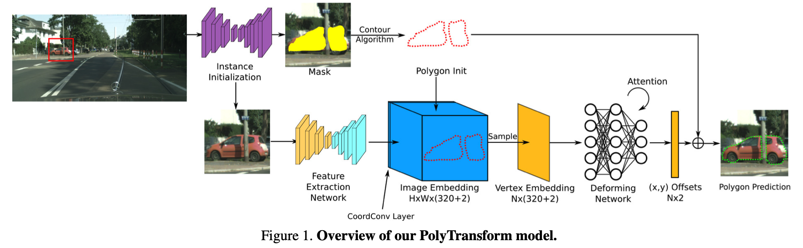

# PolyTransformer: Deep Polygon Transformer for Instance Segmentation

- **Author:** Justin Liang and Namdar Homayounfar
- **Published:** CVPR 2020
- **Reference:**
  - [Original Paper](https://arxiv.org/abs/1912.02801)

## Contribution

1. Refine instance segmentation results using polygon method
2. Acheive state-of-the-art performance in various dataset

# 3. Method

## 3.1. Instance Initialization

- Provide a good polygon initialization for each individual object.
- Plug in the other segmentation works here.
- To initialize the polygon, extract the contours from the predicted mask. (In practical, findContours algorithm in OpenCV is used.)
- Get the set of vertices at every 10 px distance in the contour. (Empirically they find such dense vertex interpolation provides a good balance between performance and memory consumption.)

## 3.2. Feature Extraction Network

- Should learn strong object boundary feature.
- FPN is employed to learn and make use of multi-scale features. (I don't think FPN is needed. I don't know why they have to use FPN instead of naive encoder, because the input of this network is already cropped and resized by bounding box.)

## 3.3. Deforming Network

- Build a feature embedding for all N vertices and learn a deforming model that can predict the offset for each branch.
- **Vertex embedding:** Extract fibers from the feature map from feature extraction network(Sec. 3.2) and concat the coordinate of each vertex. (action similar to positional encoding)
- **Deforming network:** Use generic self-attention block with N feature vectors.

# 3.4. Learning

- **Polygon Transforming Loss:** Use the Chamfer distance loss. L2 distance between prediction vetices and ground truth vetices.

# 4. Experiments

- Results is available in paperwithcodes. 