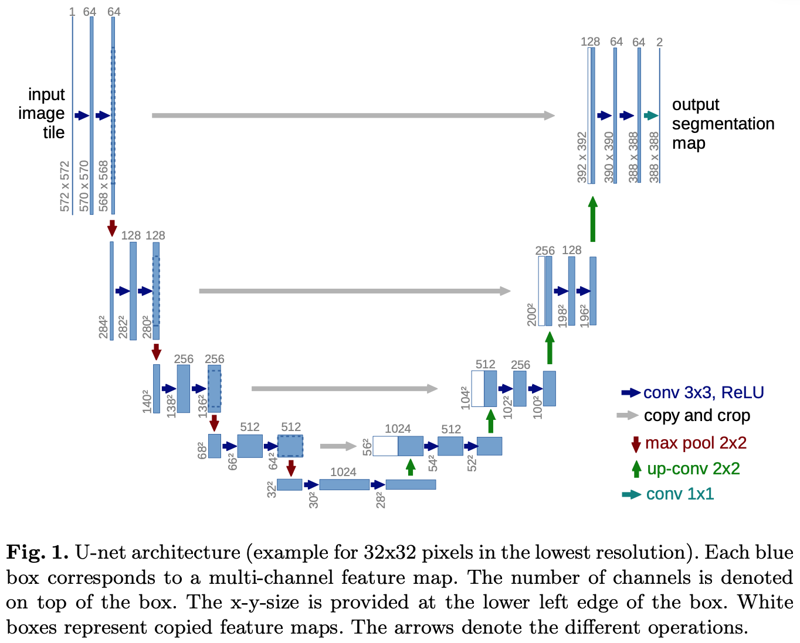

# U-Net

# Abstract

Deep networks는 많은 label된 training sample이 필요하다는 것이 지배적이다.  
본 논문에서는 존재하는 annotated samples을 보다 효율적으로 사용할 수 있는 network와 training strategy를 제안한다.  
U-Net의 구조는 context를 찾을 수 있도록 수축하는 경로와 이와 대칭되게 정확한 위치를 찾을 수 있도록 팽창하는 경로로 구성되어있다.  
U-Net은 매우 적은 수의 이미지들로 end-to-end로 훈련되었고, ISBI challenge에서 기존에 있던 모델들 중 가장 좋은 성능을 보이던 모델(a sliding-window convolutional network)보다 더 좋은 성능을 보여주었다.

> 종목은 electron microscopic stacks이었는데 이후 같은 네트워크를 transmitted light microscopy images로 다시 훈련시켜, ISBI cell tracking challenge 2015에서 큰 차이를 보이며 우승하였다.
> 심지어 이 네트워크는 빠르다. (512x512 image를 segmentation하는데에 1초도 걸리지 않는다.)

# 1. Introduction

## History of convolutional networks

Convolutional networks have already existed for a long time, but their success was limitied due to the size of the available training sets and the size of the considered networks.  
This is broken by Krizhevsky who use 8 layers and millions of parameters on the ImageNet dataset with 1 million training images. Since then, researchers have trained larger and deeper networks in classification tasks.

However, there are not only classification tasks, but also have other tasks such as localization. (especially, in biomedical tasks have)  
There are just thousands of training images for biomedical tasks.  
Hence, Ciresan et al.

1. Train a network in a **_sliding-window setup_**
2. Predict **_the class label of each pixel_**
3. Provide **_a local region(patch)_** around that pixel as input.

There are two noticeable points.

1. The network can localize.
2. The training data in terms of patches is much larger than the number of training images.

Obviously, the strategy in Ciresan et al. has two drawbacks

1. It is quite slow
   > The network must be run separately for each patch, and there is a lot of redundancy due to overlapping patches
2. There is a trade-off between localization accuracy and the use of context.
   > Larger patch vs. small patch  
   > Larger patch require more max-pooling layers which reduce the location information.  
   > Smaller patch allow the network to see only little context.

## Fully Convolutional Network

U-Net is built upon **_Fully Convolutional Network._**  
It is modified and extended for the works with very few training images and yield more precise segmentations.  
The main idea in FCN is upsampling layers which make contracted images to precise images.

## Upsampling part

### A large number of feature channels.

A large number of feature channels allow the network to propagate context information to higher resolution layers.  
As a result, the upsampling path is almost symmetric to the contracting path, and yield a u-shaped architecture.

## Overlap-tile strategy

Overlap-tile strategy allows the seamless segmentation of arbitrarily large images.

To predict the pixels in the border region of image, the missing context is extrapolated by mirroring tha input image.  
Tiling strategy applys the network to large images, and also images' resolution is not limited by the GPU memory.

## Data augmentation

If there is very little training data, data augmentation is important.  
They apply elastic defromations to training images.  
Elastic deformation is important in biomedical segmentation, because the tissue is well distorted.  
Dosovitskiy et al. suppose that the data augmentation help to learn invariance of data.

## Separation of touching objects of the same class

Use of a **_weight loss_** where the separating background labels between touching cells obtain a large weight in the loss function.

**_This network is applicable to various biomedical segmentation problems._**

# 2. Network Architecture

U-Net consists of a contracting path, expansive path, and $1\times1$ convolution.  
In total, the network has 23 convolutional layers.

## Contracting path

1. Two $3\times3$ convolutions. (unpadded convolutions, followed by ReLU)  
   Unpadding with mirroring input image is better option than zero-padding, I think.
2. $2\times2$ max pooling (stride: 2, double the number of feature)

## Expansive path

1. Up-convolution ($2\times2$ convolution, halves the number of feature channels)
2. Concatenation with the correspondingly cropped feature map from contracting path. (cropping is necessary, because unpadding has loss of border pixels)
3. Two $3\times3$ convolutions. (unpadded convolutions, followed by ReLU)

## $1\times1$ convolution

The final layer of U-Net.  
The first layer use 64-feature map, but the desired number of classes is not 64.  
$1\times1$ convolution can change the number of feature map simply.

_What is the correation between the number of channel in first layer and the real number of classes which we desire._ <!-- TODO ? -->

**_To allow a seamless tiling of the output segmentation map, selecting the input tile size is important._**  
e.g. $2\times2$ max-pooling operations are applied to a layer with an even x- and y-size.

_Does U-Net patches are seamless while they use patchwise convolution?_ <!-- TODO ? -->

# 3. Training

Train with stochastic gradient descent(SGD), implementation of Caffe.

## Input tiles

Favor large **_input tiles_** over a large batch size.

1. Make maximum use of GPU memory.
2. Minimize the overhead.  
   The output image is smaller than input **_by a constant border width._** (unpadding)

   | name          |    change    |
   | :------------ | :----------: |
   | tile size     | $\downarrow$ |
   | remove border |     $-$      |
   | remain ration | $\downarrow$ |
   | overhead      |  $\uparrow$  |

3. However, reduce the batch to a single image.
4. Accordingly, use high momentum (0.99, small mini-batch needs high momentum)

## Energy function

$$
E = \sum_{{\bf x}\in\Omega} w({\bf x})\log(p_{l({\bf x})} ({\bf x}))
$$

$p_k ({\bf x}) = {\text {exp}}(a_k ({\bf x})) / (\sum_{k'=1}^{K} {\text {exp}}(a_{k'} ({\bf x}))$ : pixel-wise soft-max over the final feature map  
$a_k({\bf x})$ : activation  
$k$ : feature channel  
${\bf x} \in \Omega$ : pixel position ($\Omega \subset \mathbb{Z} ^2$)  
$l : \Omega \rightarrow \{1,...,K\}$ : true label of each pixel  
$w : \Omega \rightarrow \mathbb{R}$ : a weight map to force the network to learn small separation borders.

$$
w({\bf x}) = w_c ({\bf x}) + w_0 \cdot {\text {exp}}(- {{(d_1({\bf x}) + d_2({\bf x}))^2} \over {2\sigma^2}})
$$

$w_c : \Omega \rightarrow \mathbb{R}$ : balance the class frequencies **_(why do we have to balance?)_**  
$d_1 : \Omega \rightarrow \mathbb{R}$ : distance to the border of the nearest cell  
$d_2 : \Omega \rightarrow \mathbb{R}$ : distance to the border of the second nearest cell  
Set constants : $w_0 = 10, \sigma \approx 5 \text{ pixels}$

If cells are touching, the weight function have large weight.  
It means finding background in touching cells region is important for loss function.

## Initialization

In deep networks, a good initialization of the weights is extremely important.  
Otherwise, parts of the network might give excessive activations, while other parts never contribute.

In this architecture, use Gaussian distribution with a standard deviation of $\sqrt{2/N}$.  
$N$ : the number of incoming nodes of one neuron. (e.g. 3x3 conv, 64 channels : $N = 9 \cdot 64 = 576$)

# 3.1. Data Augmentation

## Purpose

To teach the network the desired invariance and robustness properties. (when only few training samples are available)

## Type of data augmentation

1. Shift and rotation
2. Gray value variations
3. **_Random elastic deformations_**
4. Smooth deformations using random displacement vactors on a coarse 3x3 grid. (generated, per-pixel displacements are computed using bicubic interpolation)
5. Drop-out layers (end of the contractiong path, implicit data augmentation)

# 4. Experiments

There are 3 different segmentation applications of the U-Net.

## Segmentation of neuronal structures in electron microscopic(EM) recordings

Data : EM segmentation challenge, set of 30 images (512x512) of the Drosophila(초파리) first instar larva (성장 단계 중 하나 ?) ventral nerve cord(VNC, 복부 신경 코드)  
Tasks : Segmetation of cells(white) and membranes(black)  
Metrics : [Warping error](https://imagej.net/Topology_preserving_warping_error), [Rand error](https://imagej.net/Rand_error), [Pixel error](https://imagej.net/Topology_preserving_warping_error.html#Pixel_error)

**_U-Net got a good result for this tasks._**

## Cell segmentation task in light microscopic images

ISBI cell tracking challenge 2014 and 2015  
Matircs : Average IoU (Intersection over Union)
Also got a good result for PhC-U373, DIC-HeLa.

# 5. Conclusion

The U-Net architecture achieves very good performance on very different biomedical segmentation applications.  
Notice that the data augmentation with elastic deformation is important of training.  
U-Net has only 10 hours on a NVidia Titan GPU(6GB), Caffe-based.
