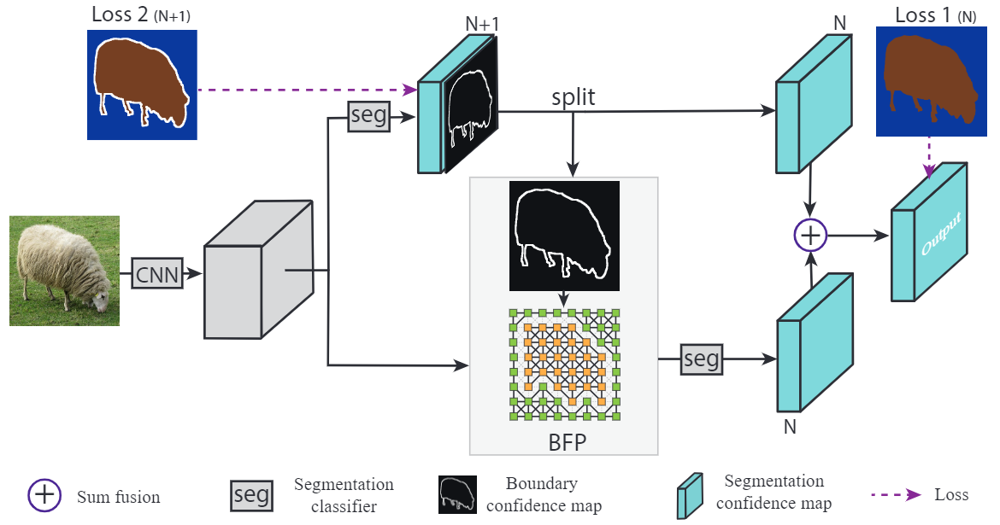
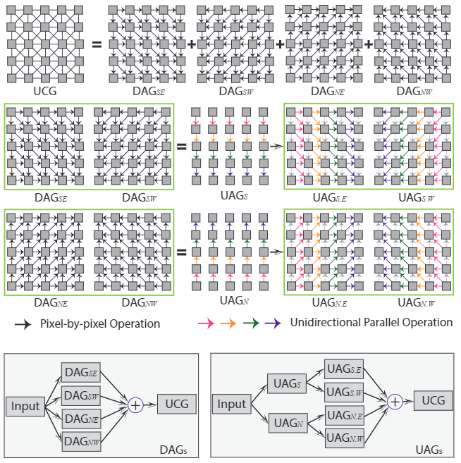

# Boundary-Aware Feature Propagation for Scene Segmentation

## Author

- Henghui Ding et al., 
- Nanyang Technological University, Singapore
- https://arxiv.org/abs/1909.00179
- Publish: ICCV 2019

## Approach

### Overview

Figure 2. An overview of the proposed approach.

### 3.1. Semantic Boundary Detection

- Pixel-wise classification with $N+1$ classes. ($1$ is the boundary class whose gt can be produced easily.)
- Previous boundary detection works did segmentation with two classes, (Boundary or off-boundary) and then do segmentation respectively.
- Boundary detection and semantic segmentation tasks are combined into one, and they benefit each other.
- Boundary를 explict하게 알려주는 것이 도움이 되는 것. $\Rightarrow$ 기존의 cross entropy나 그러한 gt와의 loss가 boundary에 대해서 알려주는 것이 부족하다는 것을 반증한다.

Figure 6. Qualitative examples of inferred boundary map.

### 3.2. Unidirectional Acyclic Graphs

Figure 3. Decompose UCG with DAGs and UAGs.

- DAG-RNN decompose Undirected Cyclic Graph (UCG) with differenct directions (southeast, southwest, northeast, northwest)
- DAG-RNN is pixel-wise RNN. It has too many loops. (High computational cost)
- To propagate information in parallel, propose Unidirectional Acyclic Graphs. (UAGs)
- UAG deals with pixels of each row in parallel and then deals with pixels of each column in parallel.
- For example, $DAG_{SE}$ is decomposed to $UAG_S$ and $UAG_{S,E}$
- As a result, the number of loops for each DAGs is reduced from $H \times W$ to $H + W$.

### 3.3. Boundary-Aware Feature Propagation

Figure 5. UAGs 1D propagation.

- UAG-structured image is formulated as $h_t = g(U * i_t + W * h_{t-1} + \delta)$.
  - $t$: Pixel position.
  - $*$: 1D convolution.
  - $U, W, \delta$: Learnable parameters.
  - $g$: Nonlinear activation function (use ReLU). 
- Build strong connections for pixels belonging to the same segment but weak connections for different segments.
- Based on confidence map, generate the propagation confidence map as $p_t = 1 - \beta f(\alpha b_t - \gamma)$.
  - $b_t$: boundary confidence of pixel $t$.
  - $\beta$: Learnable parameter.
  - $\alpha, \gamma$: Hyperparameters. (20, 4 respectively)
  - $f$: Sigmoid function.
- With the propagation confidence, $h_t = g(U * i_t + W * h_{t-1}p_{t-1} + \delta)$.
- Two directions UAG ($UAG_{S,E}$) is formulated as $h_t^j = g(U * i_t^j + W * h_{t-1}^j p_{t-1}^j + \hat{W} * h_{t-1}^{j-1} p_{t-1}^{j-1} + \delta)$.

## Experiments

### 4.2. Efficiency Analysis

Table 1. Inference speed comparison

### 4.3. Ablation Studies

Table 2. Ablation Study on PASCAL-Context. 

### 4.4. Comparison with the State-of-the-Art Works

